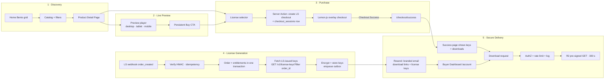
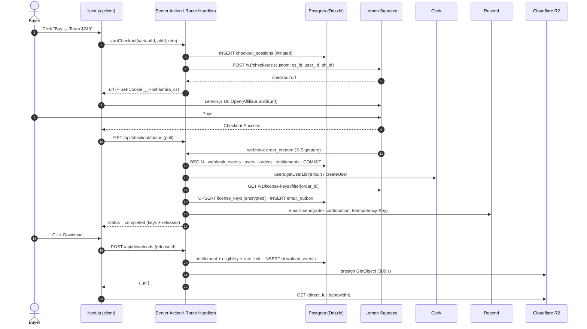
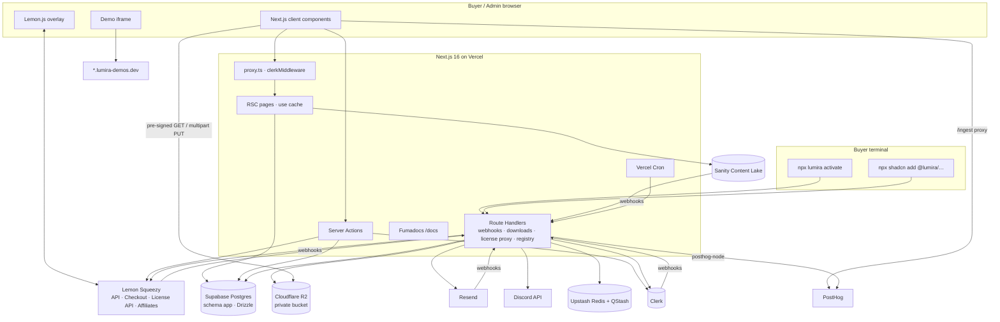
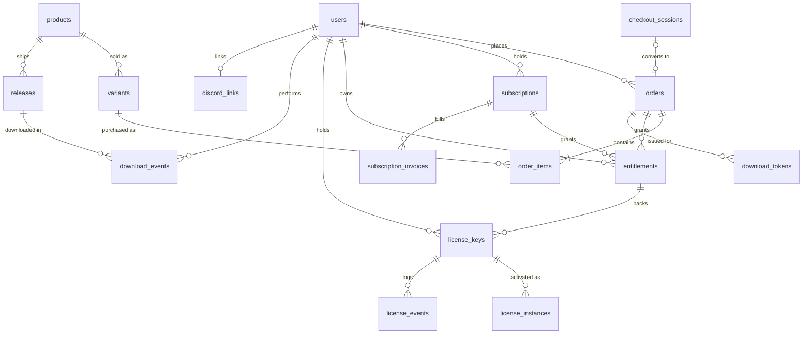

# Lumira — Product Requirements Document

| | |
|---|---|
| **Product** | Lumira — premium single-vendor storefront for high-end web assets |
| **Asset lines** | SaaS Boilerplates · UI Component Libraries · Niche Website Templates (Portfolio, Landing, Docs, Blog) |
| **Document** | `PRD.md` · v1.0 · **Status:** Approved for engineering |
| **Last updated** | 2026-09-24 |
| **Companion docs** | `StyleGuide.md` (design system, motion, Live Preview UI) · `Task.md` (implementation roadmap) |

---

## 0. How to Read This Document

### 0.1 Conventions

| Convention | Meaning |
|---|---|
| **MUST / SHOULD / MAY** | RFC 2119 requirement levels. A failed `MUST` blocks launch. |
| **P0 / P1 / P2** | P0 = launch blocker · P1 = launch target, may slip one sprint · P2 = post-launch backlog. |
| **FR-XX-nn / NFR-XX-nn** | Stable requirement IDs. `Task.md` references them; never renumber, only append. |
| `code` | Literal identifiers: routes, tables, env vars, API fields, event names. |

### 0.2 Glossary

| Term | Definition |
|---|---|
| **Asset** | A sellable product: a boilerplate, UI kit, or template. Marketing data lives in Sanity; commercial data in Lemon Squeezy. |
| **Variant** | A Lemon Squeezy (LS) purchasable option of an asset (Personal / Team / Extended license, or All-Access monthly / yearly). |
| **Release** | An immutable, versioned build of an asset (`v2.3.1`) stored as a zip in Cloudflare R2, described by a changelog entry in Sanity. |
| **Entitlement** | Lumira's derived record that a buyer may download an asset's releases. Computed from orders and subscriptions. |
| **License key** | An LS-issued key (UUID format, e.g. `38b1460a-5104-4067-a91d-77b872934d51`) attached to a variant with licensing enabled. |
| **Instance / Activation** | One activation of a license key (LS "instance"), e.g. one project where the buyer ran `npx lumira activate`. |
| **MoR** | Merchant of Record. Lemon Squeezy is the legal seller: it collects payment, remits global sales tax/VAT and issues invoices. |
| **Guest buyer** | A buyer who pays without signing in. Lumira creates their account from the order email (see F-13). |
| **Outbox** | Postgres tables of side effects written in the same transaction as the state change, then dispatched with retries: `email_outbox` (emails) and `job_outbox` (license-key fetches, LS key updates, Discord role changes, server analytics). |

### 0.3 Origins & Surfaces

| Origin | Purpose |
|---|---|
| `https://lumira.dev` | Storefront, Buyer Dashboard (`/account`), Admin (`/admin`), Docs (`/docs`), APIs, shadcn registry (`/r/*`). |
| `https://{slug}.lumira-demos.dev` | Isolated live demos, one Vercel project per template. A **separate registrable domain** prevents cookie tossing onto `lumira.dev`. |
| `https://lumira.sanity.studio` | Sanity Studio (hosted by Sanity; editors authenticate with Sanity). |
| `https://lumira.lemonsqueezy.com` | LS store: checkout overlay, customer portal, affiliate hub (`/affiliates`). |
| `mail.lumira.dev` | Resend transactional sending domain: keys, download links, receipts (SPF, DKIM, DMARC; open/click tracking off). |
| `news.lumira.dev` | Resend domain for release notices (links only to the signed-in Library; tracking allowed). |

> `lumira.dev` denotes the production domain throughout all three documents. Replace it in one place: the `NEXT_PUBLIC_APP_URL` env var.

---

## 1. Executive Summary & Vision

### 1.1 Summary

Lumira is a premium, single-vendor storefront where developers, agencies and designer-developers buy production-grade web assets. Every template can be driven live at desktop, tablet and mobile widths before purchase. Checkout is a 30-second overlay handled by Lemon Squeezy as Merchant of Record. The moment payment clears, Lumira issues a license key through Lemon Squeezy's Software Licensing API, emails a branded delivery message with secure download links and the key, and opens a Buyer Dashboard where the buyer can re-download every version, manage license activations, read the docs and join the verified-owners Discord.

### 1.2 Problem

1. **Low pre-purchase confidence.** Screenshots and GIFs hide real responsiveness, performance and code quality. Buyers of $99–$399 assets want to *use* the product first.
2. **Fragmented ownership.** Download links expire in email, license keys end up in spreadsheets, updates are announced nowhere, and documentation lives in a README inside a zip.
3. **Marketplace dilution.** Multi-vendor marketplaces have inconsistent quality, generic support and no single standard of craft.

### 1.3 Vision

> **Lumira is the Apple Store for web assets.** One curator, one standard of craft. Try anything live, buy it in 30 seconds, and own it forever: every version, every license, every doc, in one place.

### 1.4 Product Pillars

| Pillar | Promise | Primary capabilities | Leading indicator |
|---|---|---|---|
| **Try** | Drive the real product before paying. | Live Preview with device toggles; component playground; public docs | PDP → Preview open rate |
| **Buy** | Frictionless, globally compliant purchase. | LS overlay checkout, guest checkout, promo codes, affiliate attribution | Checkout completion rate |
| **Own** | Durable, versioned ownership. | License keys (LS Licensing API), versioned R2 releases, changelog, Buyer Dashboard | Median time from payment to first download |
| **Build** | Ship with the asset quickly. | `/docs` (Fumadocs), Lumira CLI activation, license-gated shadcn registry, verified-owner Discord | License activation rate within 7 days |
| **Craft** | The storefront is the portfolio. | Bento Grid 2.0, spring motion, View Transitions, sub-2s LCP | Core Web Vitals, return-visit rate |

### 1.5 Catalog & Business Model

#### 1.5.1 Asset lines

| Line | Examples | Delivered as | What the license key unlocks |
|---|---|---|---|
| **SaaS Boilerplates** | Next.js SaaS starter (auth, billing, multi-tenant) | Versioned zip from R2; optional private GitHub repo invite (P2) | `npx lumira activate` in each project (activation = project); update checks |
| **UI Component Libraries** | Marketing blocks, dashboard kit, motion primitives | Versioned zip from R2 **and** the license-gated `@lumira` shadcn registry | `npx shadcn add @lumira/<component>` with the key as a Bearer token |
| **Website Templates** | Portfolio, landing page, docs site, blog | Versioned zip from R2 | Proof of ownership for support and the verified-owner Discord (activation optional) |

#### 1.5.2 License tiers (LS variants)

| Tier | LS construct | Activation limit | Usage rights (summary) | Update policy |
|---|---|---|---|---|
| **Personal** | One-time variant, license keys on | 1 | 1 developer, 1 end product | All releases within the purchased major version |
| **Team** | One-time variant, license keys on | 5 | Up to 5 developers, unlimited internal/client projects | Same as above |
| **Extended** | One-time variant, license keys on | 25 | End products sold to end users (SaaS, paid apps) | Same as above |
| **All-Access Pass** | Subscription (monthly / yearly variants), license keys on | 10 | Every current and future asset, Team rights | Every release while the subscription is active |
| **Bundle** | One-time variant mapped to N assets in Sanity | Per included asset | Per included tier | Same as one-time |

Major-version upgrades (v2 → v3) for one-time owners are sold through an auto-issued, single-use LS discount code (see F-06).

### 1.6 Success Metrics (first 6 months after launch)

| KPI | Target | Source of truth |
|---|---|---|
| Visitor → purchase conversion | ≥ 2.0 % | PostHog (sessions) + Postgres (orders) |
| Checkout started → order completed | ≥ 55 % (abandonment ≤ 45 %) | Postgres `checkout_sessions` |
| PDP → Live Preview open rate | ≥ 40 % | PostHog |
| Preview → Buy click rate | ≥ 12 % | PostHog |
| Median payment → first download | < 60 s | Postgres (`orders.created_at` → first `download_events`) |
| License activation within 7 days (boilerplates & UI kits) | ≥ 70 % | Postgres `license_events` |
| Refund rate | < 3 % of paid orders | Postgres `orders` |
| Delivery-related support tickets | < 1 per 100 orders | Support inbox tags |
| Lighthouse Performance (mobile, PDP) | ≥ 95 | Lighthouse CI |

### 1.7 Scope

**In scope (v1):** storefront, Live Preview, docs, changelog, LS checkout/subscriptions/licensing/discounts/affiliates, R2 delivery, Clerk accounts, Buyer Dashboard, Discord token gate, Resend emails, PostHog analytics, Admin Dashboard.

**Out of scope (v1):**
- Multi-vendor sellers, payouts or revenue share.
- A multi-item cart. LS checkout is single-variant; bundles cover multi-asset purchases (FR-CO-10).
- Buyer reviews and ratings (needs moderation tooling; v1.1).
- Team seat management inside Lumira (Clerk Organizations; P2).
- Localized storefront copy. LS checkout handles currency display and tax.

### 1.8 Stack & Architecture Decisions

The mandated stack is binding. Where the brief allowed a choice, it is resolved below. Supporting services fill gaps the mandated stack does not cover; none of them replaces a mandated component.

| Layer | Decision | Rationale |
|---|---|---|
| Framework | **Next.js 16.x App Router** (current stable is 16.3), React Server Components, `cacheComponents: true` (PPR + `"use cache"`), Turbopack, React Compiler, `proxy.ts` | Static shells stream instantly; per-component caching is tag-invalidated by CMS webhooks. |
| Styling | **Tailwind CSS v4** (CSS-first `@theme`), **shadcn/ui** 4.x (Radix + Vega preset, the successor of new-york; customized "Bento 2.0"; see StyleGuide §5) | Owned component code, tokenized theming. |
| Motion | **Motion** (formerly Framer Motion; `motion/react`) spring physics + React `<ViewTransition>` for route changes | Springs for interaction; the View Transitions API for navigation, natively integrated in the App Router. |
| Payments / MoR | **Lemon Squeezy**: checkout overlay (Lemon.js), subscriptions, discounts, **Software Licensing API**, Affiliates | Mandated. Wrapped behind `BillingProvider` and `LicenseProvider` interfaces (see §10, R1). |
| CMS | **Sanity**: products, marketing copy, blog, **changelog/release notes** | Mandated. Holds no PII or transactional data. |
| Storage | **Cloudflare R2**: private bucket, pre-signed GET (downloads) and pre-signed multipart PUT (admin uploads) | Zero egress fees on multi-GB zips. |
| Auth | **Clerk** (`@clerk/nextjs`): email code, passkeys, GitHub/Google OAuth; `clerkMiddleware()` in `proxy.ts`; `auth.protect()` per resource | Frictionless login, prebuilt profile/security UI, webhooks for sync. |
| Database | **Supabase Postgres** + **Drizzle ORM**. Tables live in a dedicated `app` schema that is not exposed through the Supabase Data API. RLS is enabled on every table with a policy only for the app role, so Supabase's public roles are denied (defense in depth). The app connects through the Supavisor transaction pooler (`prepare: false`). | Brief allowed Supabase or Vercel. Supabase gives PITR, SQL editor and region choice. (Vercel's Postgres offering is now delivered through Marketplace partners, so choosing it would add an indirection.) |
| Email | **Resend + React Email** via a transactional outbox | Branded, typed templates; idempotency keys; batch sends of up to 100. |
| Docs | **Fumadocs** (`fumadocs-core`/`fumadocs-ui` 16.x, `fumadocs-mdx` 15.x) at `/docs`, MDX in-repo | Docs are code-adjacent, versioned with Git, need MDX components, Shiki, Twoslash and Orama search. Sanity keeps changelogs; docs pages link to changelog entries and back. |
| Analytics | **PostHog** (product analytics, funnels, sampled session replay, reverse-proxied through `/ingest`) + **Vercel Speed Insights** (Core Web Vitals RUM) | Funnels and abandonment need event analytics; Vercel Web Analytics alone cannot model funnels. |
| Supporting | **Upstash Redis** (rate limits, license-validation cache), **Upstash QStash** (fan-out jobs), **Vercel Cron**, **Sentry** (errors/tracing), **Discord API** (token gate) | Operational gaps not covered by the mandated stack. |

---

## 2. User Personas

### 2.1 Buyer Persona A — "Indie Founder Ines"

| Attribute | Detail |
|---|---|
| Role | Solo technical founder shipping an MVP in under 4 weeks |
| Buys | SaaS Boilerplate (Personal → later Extended); considers All-Access |
| Jobs-to-be-done | Skip auth/billing/multi-tenancy plumbing; start from code she trusts. |
| Anxieties | "Is it maintained? Does it use my versions (Next 16, React 19, Tailwind 4)? Will I get updates? Can I use it in a paid SaaS?" |
| Decision drivers | Live demo, stack/version badges, changelog recency, doc depth, clear Extended-license terms. |
| Moment of delight | Pays → key and download arrive in the same minute → `npx lumira activate` works on the first try. |
| Devices | Discovers on mobile (X, newsletters), evaluates and buys on desktop. |

### 2.2 Buyer Persona B — "Agency Lead Arjun"

| Attribute | Detail |
|---|---|
| Role | Lead developer at a 6–20 person agency |
| Buys | UI Component Libraries (Team), Landing templates (Extended), bundles |
| Jobs-to-be-done | Reuse components across many client projects; onboard new devs quickly; stay license-compliant. |
| Anxieties | Seat/activation limits, invoices with VAT ID, re-downloading for new hires. |
| Decision drivers | Viewport-accurate preview (checks mobile carefully), registry install flow, activation management UI. |
| Moment of delight | Adds a component with `npx shadcn add @lumira/pricing-table` using the team key; frees an activation from the dashboard when a project ends. |

### 2.3 Buyer Persona C — "Designer-Developer Dana"

| Attribute | Detail |
|---|---|
| Role | Freelance designer who codes; buys portfolio templates |
| Jobs-to-be-done | Look premium fast; customize without deep refactors. |
| Decision drivers | Visual fidelity and motion quality in the preview, dark mode, Figma file included, "How to edit content" docs. |
| Anxieties | "Will it look like the demo once I swap in my content?" |

### 2.4 Admin Persona — "Owner-Operator Omar" (the vendor)

| Attribute | Detail |
|---|---|
| Role | Sole owner: developer, marketer and support desk |
| Jobs-to-be-done | Ship a release in under 5 minutes (upload → notes → publish → notify); check revenue and MRR health at a glance; resolve "I can't download / activate" tickets in under 2 minutes; run a launch promo. |
| Constraints | No ops team. The dashboard must summarize LS, R2, Sanity, Clerk and PostHog so he rarely opens their consoles. |
| Success moment | Opens a customer's timeline, sees "activation limit reached (1/1)", raises the limit with a reason, and replies within 90 seconds. |

### 2.5 Secondary Persona — "Affiliate Partner Priya"

A creator or newsletter author who promotes Lumira. She finds the **Affiliates** link in the footer, reads the commission terms on `/affiliates`, signs up in the LS Affiliate Hub, and shares `?aff=` links. Lumira MUST preserve attribution through the overlay checkout (FR-GS-03).

### 2.6 Persona → Capability Priority

| Capability | Ines | Arjun | Dana | Omar |
|---|:-:|:-:|:-:|:-:|
| Live Preview with device toggles | ● | ●● | ●●● | — |
| Docs (`/docs`) | ●●● | ●● | ● | ● |
| Changelog / versions | ●●● | ●● | ● | ●● |
| License key management | ●● | ●●● | ○ | ●● |
| shadcn registry | ○ | ●●● | ○ | ● |
| Discord (verified owners) | ●● | ● | ● | ●● |
| Admin analytics | — | — | — | ●●● |

(●●● critical · ●● important · ● useful · ○ rarely used · — not applicable)

---

## 3. User Flows

### 3.1 Golden Path: Discovery → Live Preview → Purchase → License Generation → Secure Delivery



### 3.2 Stage Specifications

#### Stage 1 — Discovery

| Step | User action | System behavior | Data / analytics | Failure handling |
|---|---|---|---|---|
| 1.1 | Lands on `/` from social or search | Static shell from cache (`cacheTag('home')`); Bento hero composed from Sanity `homePage`; affiliate tracking script (3.5 kB, `defer`) loads; `?code=` or `?aff=` captured | PostHog `$pageview` with UTM; promo cookie `lumira_promo` (7 days) if `?code=` present | Sanity outage: last cached shell is served (cache never expires on error) |
| 1.2 | Browses `/templates?type=portfolio&stack=nextjs` | Filters are URL search params (`nuqs`); server-filtered grid; chips update optimistically | `catalog_filtered` {filters} | Empty result: `Empty` state with "Clear filters" and 3 popular picks |
| 1.3 | Opens a PDP | `<ViewTransition name="product-media-{slug}">` morphs card media into the PDP hero; price and variants come from the Sanity cache (synced from LS) | `product_viewed` {slug, type, price} | Unknown slug → `not-found.tsx` with related products |

#### Stage 2 — Live Preview

| Step | User action | System behavior | Data / analytics | Failure handling |
|---|---|---|---|---|
| 2.1 | Clicks **Live Preview** | Soft navigation opens the intercepted modal route `@modal/(.)products/[slug]/preview`; a hard load or shared link renders the full-screen `/products/[slug]/preview`. The iframe loads `https://{slug}.lumira-demos.dev{path}` behind a skeleton. | `preview_opened` {slug, entry: pdp or card or direct} | 8 s without the ready signal → fallback gallery + "Open demo in new tab" (`preview_load_failed`) |
| 2.2 | Switches Desktop / Tablet / Mobile | The iframe gets the target CSS viewport once; the frame box animates with the `smooth` spring and the iframe scale follows (no reflow per frame, StyleGuide §7.4). State mirrors to `?device=`. | `preview_device_changed` {from, to} | — |
| 2.3 | Navigates inside the demo | The optional bridge script posts `lumira:navigate`; the toolbar page picker updates and `?path=` syncs | `preview_page_changed` | Bridge absent: picker still works one-way (parent sets `src`) |
| 2.4 | Clicks the persistent **Buy — $149** | The license selector opens *over* the preview; the demo stays mounted | `preview_buy_clicked` {device, secondsInPreview} | — |

#### Stage 3 — Purchase

| Step | User action | System behavior | Data / analytics | Failure handling |
|---|---|---|---|---|
| 3.1 | Picks a tier (Personal / Team / Extended) or All-Access | Selector shows price, activation limit, usage rights, and "Included in All-Access". An applied promo code shows "LAUNCH30 applied at checkout". A signed-in owner sees "Owned · Open Library" or an upgrade CTA instead. | `license_selector_opened`, `license_tier_selected` | — |
| 3.2 | Confirms | Server Action `startCheckout()` validates the variant, inserts `checkout_sessions` (`initiated`), calls LS `POST /v1/checkouts` with `checkout_data.custom = {cs_id, user_id, ph_id, utm}`, email/name prefill for signed-in users, `discount_code`, `embed: true`, `expires_at` +24 h. It sets the `__Host-lumira_cs` cookie. | Server event `checkout_started` (distinct id = PostHog id) | LS API error → toast "Checkout is temporarily unavailable" + retry; Sentry alert |
| 3.3 | Overlay opens | Client runs `LemonSqueezy.Affiliate.Build(url)` to keep affiliate attribution, then `LemonSqueezy.Url.Open(url)` | — | Lemon.js failed to load → full-page redirect to the checkout URL |
| 3.4 | Pays (card, PayPal, Apple Pay, Google Pay) | LS computes tax and applies the discount. On success Lemon.js emits `Checkout.Success`; the client routes to `/checkout/success?cs={id}`. | `checkout_success_client` | Declines are handled inside the LS overlay. Lemon.js emits **no close event**, so abandonment is inferred server-side (FR-SYS-02). |

#### Stage 4 — License Generation

| Step | Trigger | System behavior | Data | Failure handling |
|---|---|---|---|---|
| 4.1 | LS `order_created` webhook | Verify `X-Signature` (HMAC-SHA256 hex of the raw body); compute the idempotency key; insert `webhook_events` with `ON CONFLICT DO NOTHING` | `webhook_events` | Bad signature → 401 + security log. Duplicate → 200, no-op. |
| 4.2 | Same transaction | Resolve the Clerk user by email (create if absent, F-13); insert `orders`, `order_items`; derive `entitlements` (bundles expanded through `variants.bundle_product_ids`); mark `checkout_sessions.completed` | `users`, `orders`, `order_items`, `entitlements` | Exception → rollback → 500 so LS re-delivers; daily reconciliation backfills (FR-SYS-04) |
| 4.3 | After commit | Fetch the LS-issued keys: `GET /v1/license-keys?filter[order_id]={id}` (retry 5× with exponential backoff 2 s → 30 s). The `license_key_created` webhook upserts the same rows idempotently, whichever arrives first. Keys are AES-256-GCM encrypted, plus an HMAC lookup hash. | `license_keys`, `license_events(issued)` | Keys still missing after retries → email is sent with "Your key is being generated" and a follow-up email is queued on `license_key_created` |
| 4.4 | Outbox | Enqueue `order-confirmation` email (idempotency key `order-confirmation:{orderId}`), PostHog `purchase_completed` (server), Discord eligibility refresh | `email_outbox` | Dispatcher retries with backoff; cron sweeper every 5 min |

#### Stage 5 — Secure Delivery

| Step | User action | System behavior | Data | Failure handling |
|---|---|---|---|---|
| 5.1 | Waits on the success page | Polls `GET /api/checkout/status?cs=` (1 s, 2 s, 4 s … max 30 s). When `completed` and the `__Host-lumira_cs` cookie matches, it renders the license key(s), download buttons and "Open your Library". Guest scope is valid for 30 min after completion. | — | Timeout → "We're finalizing your order — check your inbox" + support link |
| 5.2 | Opens the email | **Order confirmation**: per-asset download button (`https://lumira.dev/d/{token}`, 72 h, max 5 uses), full license key in a Geist Mono block, activation one-liner, docs link, "Open your Library" (single-use Clerk sign-in token), LS receipt link | `email_outbox.sent` | Bounce → Resend webhook flags the order for admin follow-up |
| 5.3 | Clicks download | `/d/{token}` renders an **interstitial** with a confirm button. The POST confirm prevents corporate link scanners from burning uses. Dashboard buttons call `POST /api/downloads`. | — | Invalid or expired token → sign-in CTA to the Library |
| 5.4 | Download authorized | Checks: identity (Clerk session or guest scope or token) → active entitlement → release eligibility (major version / All-Access window) → rate limit (10/h per user per asset) → write `download_events` → pre-signed R2 GET (TTL 300 s, `Content-Disposition: attachment; filename="{slug}-{semver}.zip"`) | `download_events` | 403 not entitled (upgrade CTA) · 429 with `Retry-After` · R2 error → one retry, then an error ID |

### 3.3 Sequence: Purchase → License → Email → Download



### 3.4 Secondary Flows

| ID | Flow | Steps & system behavior |
|---|---|---|
| **F-01** | Returning buyer sign-in and re-download | `/sign-in` (Clerk: email code, passkey, GitHub/Google) → `/account/library` → asset → release history → Download (FR-DL-02 rules). Previously downloaded versions stay downloadable forever for one-time owners. |
| **F-02** | License activation in a buyer's project | Buyer runs `npx lumira@latest activate` → CLI calls `POST https://lumira.dev/api/v1/licenses/activate` {license_key, instance_name, product} → Lumira calls LS `POST /v1/licenses/activate` → verifies `meta.store_id` and `meta.product_id` match Lumira → writes `license_instances`, `license_events(activated)` → CLI stores the instance id in `.lumira/license.json`. At the limit, LS returns `activated: false` and the CLI shows "Activation limit reached — manage at lumira.dev/account/licenses". |
| **F-03** | Free an activation | `/account/licenses` → key → instances table → "Deactivate" → confirm dialog → LS `POST /v1/licenses/deactivate` {license_key, instance_id} → `license_events(deactivated)` → usage bar animates down. |
| **F-04** | All-Access lifecycle | `subscription_created` → `subscriptions` + `entitlements(kind=all_access, valid_until=renews_at)` + license key. `subscription_updated` keeps status/renewal in sync. `subscription_payment_failed` → `past_due` banner + dunning email (update-payment link from LS). `subscription_cancelled` → access until `ends_at`. `subscription_expired` → entitlement closed at `ends_at`, key disabled via `PATCH /v1/license-keys/{id}` `{disabled: true}`, Discord role revoked. Releases published before expiry stay downloadable. |
| **F-05** | Refund | `order_refunded` → `orders.status = refunded` → entitlements `revoked` → keys disabled (PATCH `disabled: true`) → Discord role revoked → `refund-processed` email → audit entry. |
| **F-06** | Tier or major-version upgrade | Owner clicks "Upgrade to Team" or "Get v3" → server creates a single-use LS discount (`is_limited_redemptions: true`, `max_redemptions: 1`, limited to the target variant, amount = prior price paid or the upgrade rate) → checkout prefilled with the code. |
| **F-07** | Discord token gate | Visible only to verified license holders (FR-GS-05). "Join Discord" → Discord OAuth (`identify guilds.join`) → callback re-verifies the license → bot `PUT /guilds/{guild}/members/{user}` with the `Verified Owner` role (or adds the role if already a member) → `discord_links` row → redirect into the welcome channel. Revocation on refund, disable or expiry. |
| **F-08** | Licensed docs pages | Public docs are open and indexable. Pages with frontmatter `access: licensed` render the intro + an ownership CTA for non-owners, full content for owners (server-side entitlement check). They are excluded from the search index body and set `noindex`. |
| **F-09** | Affiliate referral | Visitor lands with `?aff=XXXX` → the LS affiliate script stores an anonymous tracking id → at checkout, `LemonSqueezy.Affiliate.Build(url)` appends the tracking parameter → LS credits the referral (first or last click, per LS settings). |
| **F-10** | Admin publishes a release | `/admin/products/{id}/releases/new` → drop zip → browser SHA-256 (Web Worker) + multipart upload straight to R2 via pre-signed parts → Complete → semver + changelog form (writes a Sanity `release` doc) → Publish → `releases.status = published` → cache tags revalidated → owners notified via QStash fan-out (Resend batch, 100 per call). |
| **F-11** | Admin creates a promo | `/admin/discounts/new` → form → LS `POST /v1/discounts` → mirrored in `discounts` → shareable link `https://lumira.dev/?code=CODE` + optional site-wide banner (Sanity `siteSettings.promoBanner`). LS has no update endpoint, so "Edit" = clone + delete with an explicit warning. |
| **F-12** | Failed payment (dunning) | `subscription_payment_failed` → `payment_events(payment_failed)` → admin feed → buyer email with the LS update-payment-method link → `subscription_payment_recovered` clears the state. |
| **F-13** | Guest → account | On first order for an unknown email, the webhook creates a Clerk user (`skipPasswordRequirement`). The email's "Open your Library" link carries a single-use Clerk sign-in token (7-day expiry) redeemed on `/auth/continue` after an explicit click (scanner-safe). A Clerk `user.created` webhook also **claims** unlinked orders whose `customer_email` matches a *verified* address. |

---

## 4. Functional Requirements

### 4.1 Global Shell (FR-GL)

| ID | Requirement | Pri |
|---|---|---|
| FR-GL-01 | **Header**: wordmark, primary nav (Boilerplates, UI Kits, Templates, All-Access, Docs, Changelog), ⌘K trigger, theme toggle, account chip. Signed out → "Sign in". Signed in → avatar menu (Library, Licenses, Billing, Sign out; "Admin" for admins). Glass header condenses 72 → 56 px on scroll with the `snappy` spring. | P0 |
| FR-GL-02 | **Command palette (⌘K)**: products, docs pages (Fumadocs search API), changelog versions and actions (toggle theme, open Library). | P1 |
| FR-GL-03 | **Theme**: `system` / `light` / `dark` via `next-themes` (class strategy). Switching animates a circular View Transition reveal from the toggle (instant under reduced motion). | P0 |
| FR-GL-04 | **Footer**: product links; Resources (Docs, Changelog, Blog, Status); Legal (License, Refunds, Terms, Privacy); **Affiliates — Earn {rate}%** (FR-GS-01); MoR disclosure "Payments, tax and invoicing handled by Lemon Squeezy, our Merchant of Record"; social links. | P0 |
| FR-GL-05 | **Promo banner**: dismissible top bar driven by Sanity `siteSettings.promoBanner` or an active `lumira_promo` cookie. | P1 |
| FR-GL-06 | **Route transitions**: React `<ViewTransition>` with `transitionTypes={['nav-forward' or 'nav-back']}` on `<Link>`. The header is anchored (`viewTransitionName: 'site-header'`). Degrades to instant navigation without API support. | P1 |
| FR-GL-07 | Branded `not-found.tsx`, `error.tsx` and `global-error.tsx` with a support link and Sentry event ID. | P0 |
| FR-GL-08 | **Environment banner** on non-production deployments: "Test mode — use card 4242 4242 4242 4242". | P0 |

### 4.2 Storefront Discovery (FR-SF)

| ID | Requirement | Pri |
|---|---|---|
| FR-SF-01 | **Home Bento hero** composed in Sanity `homePage.bento[]`. Tile types: `featuredProduct`, `stat`, `testimonial`, `stackBadges`, `changelogTeaser`, `allAccessPromo`, `docsTeaser`, `video`. Spans are validated against the Bento composition rules (StyleGuide §4.3) in Sanity validation and again at render; an invalid band falls back to the nearest preset. | P0 |
| FR-SF-02 | **Home sections**: Bento hero → "New & Updated" rail (sorted by latest release) → category showcase → Live Preview teaser clip → All-Access pitch → testimonials (real, attributed with permission) → FAQ → closing CTA. | P0 |
| FR-SF-03 | **Category routes**: `/boilerplates`, `/ui-kits`, `/templates`, `/templates/[type]` (portfolio, landing, docs, blog). | P0 |
| FR-SF-04 | **Filters**: type, framework (Next.js, Astro, React Router, SvelteKit), styling, features (Auth, Payments, i18n, CMS, Dark mode, Animations), price range, sort (Newest, Recently updated, Popular, Price). URL-synced with `nuqs`; results server-rendered inside Suspense; URLs shareable. | P0 |
| FR-SF-05 | **Product card**: 16:10 media (AVIF poster; muted hover-play video ≤ 1.5 MB, `preload="none"`, disabled under reduced motion or `Save-Data`), name, one-line value prop, "from $X", 3 stack badges, freshness label ("Updated 3 days ago"), "All-Access" chip. | P0 |
| FR-SF-06 | "Load more" cursor pagination via Server Action. No infinite scroll. | P1 |
| FR-SF-07 | **PDP section order**: Hero (media, title, tagline, price-from, CTAs "Live Preview" + "Buy") → Bento feature grid → Stack & versions table (from the latest release's `compatibility`) → What's included (file tree) → Demo Lighthouse scores → License comparison → Changelog excerpt (latest 3) → Docs quick links → FAQ → Related products. | P0 |
| FR-SF-08 | **Sticky purchase rail**: right column on desktop; bottom bar with safe-area inset on mobile. Shows selected tier, price, Buy, "Included in All-Access" and ownership state. | P0 |
| FR-SF-09 | Prices in USD (store currency) with "Tax/VAT calculated at checkout". Prices come from the Sanity cache synced from LS variants (FR-AD-51) and are never hard-coded. | P0 |
| FR-SF-10 | **JSON-LD**: `Product` + `Offer`, `SoftwareApplication` (`applicationCategory: DeveloperApplication`), `BreadcrumbList`, `FAQPage`. | P0 |
| FR-SF-11 | **Ownership awareness**: signed-in owners see "Owned · Team", "Open in Library" and upgrade CTAs, rendered in a Suspense-wrapped dynamic hole so the page shell stays static (PPR). | P1 |
| FR-SF-12 | **Bundles** `/bundles/[slug]`: included assets with per-asset preview links and savings versus individual prices. | P1 |
| FR-SF-13 | **All-Access** `/all-access`: monthly/yearly plans, live asset count, comparison with one-time licenses, FAQ. | P0 |
| FR-SF-14 | **Blog** `/blog` from Sanity (Portable Text; Shiki code blocks). | P2 |

### 4.3 Changelog & Versioning UI (FR-CL)

| ID | Requirement | Pri |
|---|---|---|
| FR-CL-01 | The Sanity `release` document is the display source: `product` (ref), `version` (semver, validated), `releasedAt`, `type` (major/minor/patch), `title`, `summary`, `highlights` (Portable Text with media), `changes[]` `{kind: added or improved or fixed or removed or deprecated or security or breaking, text, docsPath?}`, `upgradeGuide` (required for majors), `compatibility {next, react, tailwind, node}`, `releaseId` (Postgres `releases.id`, written by the admin publish flow). | P0 |
| FR-CL-02 | **Global changelog** `/changelog`: reverse-chronological timeline grouped by month; filter by product and change kind; Geist Mono version pills (`v2.3.0`); "New" badge for releases under 14 days old; deep links `#{product}-v2-3-0`. | P0 |
| FR-CL-03 | **Product changelog** `/products/[slug]/changelog`: version list, latest highlighted, breaking-change callouts, upgrade-guide accordion. | P0 |
| FR-CL-04 | **Feeds**: `/changelog/feed.xml` (Atom) and `/products/[slug]/changelog/feed.xml`. | P1 |
| FR-CL-05 | Card and PDP freshness labels derive from the latest *published* release. | P0 |
| FR-CL-06 | **"What's new since your version"** in the Buyer Dashboard: releases between the user's newest downloaded version and the newest eligible one. | P1 |
| FR-CL-07 | Only releases with `releases.status = 'published'` render. Yanked releases show a "Withdrawn" note and are never deleted from history. | P0 |
| FR-CL-08 | Release notes never contain download URLs. Every download goes through FR-DL. | P0 |

### 4.4 Live Preview (FR-LP)

UI specification: StyleGuide §7.

| ID | Requirement | Pri |
|---|---|---|
| FR-LP-01 | Demos are served only from `https://{slug}.lumira-demos.dev`, never from `lumira.dev`. | P0 |
| FR-LP-02 | **iframe contract**: `sandbox="allow-scripts allow-same-origin allow-forms allow-popups allow-popups-to-escape-sandbox"` (no `allow-top-navigation`), `allow=""` (no camera, mic, geolocation or payment), `referrerpolicy="strict-origin-when-cross-origin"`, `title="Live preview of {name}"`. Storefront CSP: `frame-src https://*.lumira-demos.dev`. Demo responses send `Content-Security-Policy: frame-ancestors https://lumira.dev` and `X-Robots-Tag: noindex`. | P0 |
| FR-LP-03 | **Device presets**: Desktop 1440 × 900, Tablet 834 × 1194, Mobile 393 × 852, rotation for tablet/mobile, and "Fit" (fills the stage, truly responsive). The iframe renders at its true CSS viewport and is scaled with `transform: scale()`. | P0 |
| FR-LP-04 | **Toolbar**: product name + version pill, device toggle group (radiogroup semantics), rotate, page picker (Sanity `demo.pages[]`), reload, open in new tab, theme hint (when the demo supports `?theme=`), close. | P0 |
| FR-LP-05 | **Persistent Buy CTA** with price and tier selector; opens checkout without unmounting the demo; switches to "Open in Library" for owners. | P0 |
| FR-LP-06 | **postMessage bridge** (`@lumira/preview-bridge`, optional in demos): `lumira:ready`, `lumira:navigate`, `lumira:theme`. The parent validates `event.origin` and `event.source === iframe.contentWindow`; the child validates the parent origin. | P1 |
| FR-LP-07 | **Lifecycle**: `loading` → `ready` (load event or bridge ready) → `slow` (> 3 s, "Warming up the demo…") → `failed` (> 8 s or error: screenshot gallery + open in new tab). | P0 |
| FR-LP-08 | **Component Playground** variant for UI kits: component rail, iframe route `/c/{component}` on the demo origin, "Code" tab with a server-highlighted (Shiki) teaser of the first 30 lines. Full source is delivered through the registry. | P1 |
| FR-LP-09 | **Memory hygiene**: with `cacheComponents`, Next.js keeps recently visited routes mounted but hidden via React `<Activity>`. The player MUST set the iframe `src` to `about:blank` in its effect cleanup and restore it when shown, so hidden demos stop consuming CPU and audio. | P0 |
| FR-LP-10 | **Touch devices** default to the Mobile preset at scale 1. The Desktop preset stays available as a scaled, scrollable view. | P1 |
| FR-LP-11 | **Demo budgets**: each demo meets LCP ≤ 2.5 s (mobile) in its own CI. A slow demo reflects on Lumira. | P1 |

### 4.5 Documentation (FR-DOC)

| ID | Requirement | Pri |
|---|---|---|
| FR-DOC-01 | Fumadocs at `/docs`: a docs home listing products, content in `content/docs/{product}/**/*.mdx` with `meta.json` ordering, one sidebar tree per product (root folders as sidebar tabs). | P0 |
| FR-DOC-02 | **Frontmatter schema** (Zod 4, extends `pageSchema`): `title`, `description`, `product`, `access: 'public' or 'licensed'` (default `public`), `since` (semver), `updated` (date). Invalid frontmatter fails the build. | P0 |
| FR-DOC-03 | **Required pages** per boilerplate: Getting Started, Installation, Environment Variables, Activating your license, Project Structure, Deployment, Upgrading (links to changelog upgrade guides), Troubleshooting, FAQ. UI kits: Registry install, Theming, per-component API. Templates: Setup, Editing content, Deploy. | P0 |
| FR-DOC-04 | **Search**: Orama via `createFromSource` at `/api/search`, integrated with ⌘K. Licensed pages index title and description only. | P0 |
| FR-DOC-05 | **Licensed pages** (F-08): server-side entitlement check; `noindex`; teaser + ownership CTA for non-owners. | P1 |
| FR-DOC-06 | **MDX components**: `Callout`, `Steps`, `Tabs` (pnpm/npm/bun), `Files`, `TypeTable`, Shiki dual-theme code blocks with copy, Twoslash (P2), and `LicenseSnippet`, which renders the signed-in owner's install snippet with a masked key reference. | P1 |
| FR-DOC-07 | **SEO**: per-page metadata, dynamic OG images, canonical URLs, sitemap entries for public pages. | P0 |
| FR-DOC-08 | `/llms.txt` and `/llms-full.txt` generated from **public** pages only. | P2 |
| FR-DOC-09 | **Cross-linking**: `changes[].docsPath` links releases to docs; docs pages show "Added in v2.1" badges from `since`. | P1 |
| FR-DOC-10 | Fumadocs CSS variables mapped to Lumira tokens (StyleGuide §5.9) so docs are visually indistinguishable from the storefront. | P0 |

### 4.6 Checkout (FR-CO)

| ID | Requirement | Pri |
|---|---|---|
| FR-CO-01 | **License selector** (bottom sheet on mobile, dialog on desktop): tiers with price, activation limit, rights summary and a compare link; All-Access upsell row. | P0 |
| FR-CO-02 | **`startCheckout` Server Action**: Zod-validated `{variantId, phDistinctId, utm}` → variant active in `variants` → optional Clerk user → insert `checkout_sessions` → LS `POST /v1/checkouts` with `checkout_data {email, name, discount_code, custom: {cs_id, user_id, ph_id, utm_source, utm_medium, utm_campaign}}`, `checkout_options {embed: true, media: false, logo: true, desc: true, discount: true, dark, button_color: '#5856e9'}`, `product_options {redirect_url, receipt_button_text: 'Open your Lumira Library', receipt_link_url}`, `expires_at` (+24 h) and `test_mode` outside production. Returns the URL and sets `__Host-lumira_cs` (HttpOnly, Secure, SameSite=Lax, 2 h). | P0 |
| FR-CO-03 | **Lemon.js** loads lazily (`next/script`, `lazyOnload`) only on routes with purchase CTAs; `window.createLemonSqueezy()` after load; `LemonSqueezy.Setup({ eventHandler })` handles `Checkout.Success`. If the script fails, fall back to a full-page redirect. | P0 |
| FR-CO-04 | **Affiliate attribution**: `LemonSqueezy.Affiliate.Build(url)` runs before `LemonSqueezy.Url.Open(url)`. | P0 |
| FR-CO-05 | **Promo codes**: `?code=` stored in `lumira_promo` (7 days) and validated against the `discounts` mirror (active, in window, applies to the variant) before being passed as `discount_code`. | P1 |
| FR-CO-06 | **Success page** `/checkout/success`: polling state machine (`pending` → `completed` or `delayed`), receipt tile (order #, items, total), license keys, downloads and next steps (Activate, Docs, Discord). | P0 |
| FR-CO-07 | **Duplicate-purchase guard**: owners of the same tier see "Owned"; higher tiers use upgrade pricing (F-06). | P1 |
| FR-CO-08 | **Abuse controls**: 20 req/min/IP on `startCheckout`; at most 3 open sessions per IP per 10 min; Vercel BotID on the action (P1). | P0 |
| FR-CO-09 | Non-production deployments use a Lemon Squeezy **test-mode** API key and store. | P0 |
| FR-CO-10 | **Bundles** are LS products whose variant maps to several Lumira products (`variants.bundle_product_ids`). | P1 |

### 4.7 Licensing Engine (FR-LIC)

| ID | Requirement | Pri |
|---|---|---|
| FR-LIC-01 | Keys are issued **only** by Lemon Squeezy. "Generate license keys" is enabled on **every** variant: boilerplates, UI kits, templates and All-Access. Activation limits follow §1.5.2; license length is unlimited for one-time variants. On templates the key serves as proof of ownership for support and Discord; activation is optional there. | P0 |
| FR-LIC-02 | **Retrieval**: `order_created` → `GET /v1/license-keys?filter[order_id]=`. `license_key_created` and `license_key_updated` webhooks upsert the same rows on `ls_license_key_id`. | P0 |
| FR-LIC-03 | **Storage**: `key_ciphertext` (AES-256-GCM, random 96-bit IV, `LICENSE_ENCRYPTION_KEY`), `key_hash` = HMAC-SHA256(key, `LICENSE_HASH_PEPPER`) for lookups, and LS `key_short` for masked display. Plaintext keys never reach logs (Sentry `beforeSend` scrubber). | P0 |
| FR-LIC-04 | **Status mirror**: LS statuses `inactive` (not activated yet), `active`, `expired`, `disabled`. A **verified license holder** has at least one key in `inactive` or `active` that is not disabled. | P0 |
| FR-LIC-05 | **CLI proxy** `/api/v1/licenses/{activate or validate or deactivate}` calls the LS License API (`Accept: application/json`, form-encoded POST) and **rejects** any response whose `meta.store_id` differs from `LS_STORE_ID` or whose `meta.product_id` is not in Lumira's catalog. The License API accepts keys from any store, so this check is mandatory. | P0 |
| FR-LIC-06 | **Rate limits**: the LS License API allows 60 requests/min. Validation results are cached in Redis (`lic:{key_hash}`: valid 10 min, invalid 60 s); the proxy allows 30 req/h per key and answers 429 with `Retry-After`. | P0 |
| FR-LIC-07 | **Activation log**: every activate, deactivate and validation failure writes `license_events` (IP hash, country, user agent, instance name). Successful validations are sampled at most once per key per hour. | P0 |
| FR-LIC-08 | **External activation sync**: a nightly job lists `GET /v1/license-key-instances?filter[license_key_id]=` for keys with activity in the last 48 h; unseen instances become `license_events(activated, source = external)`. | P0 |
| FR-LIC-09 | **Revocation**: refund or All-Access expiry → `PATCH /v1/license-keys/{id}` `{disabled: true}`; resume or reactivation → `{disabled: false}`. | P0 |
| FR-LIC-10 | **Admin overrides**: change `activation_limit`, disable or enable, set `expires_at`. A reason is mandatory; every change is audited. | P0 |
| FR-LIC-11 | **Registry authorization** (UI kits): `GET /r/{name}.json` requires `Authorization: Bearer <license_key>` → 401 if missing or invalid, 403 if the key is valid but the component belongs to an uncovered product; `Cache-Control: private, no-store`. | P1 |
| FR-LIC-12 | **Registry snippet** shown in the dashboard and docs: `"registries": { "@lumira": { "url": "https://lumira.dev/r/{name}.json", "headers": { "Authorization": "Bearer ${LUMIRA_LICENSE_KEY}" } } }`. | P1 |

### 4.8 Secure Delivery (FR-DL)

| ID | Requirement | Pri |
|---|---|---|
| FR-DL-01 | **R2 layout**: `products/{productId}/releases/{semver}/{slug}-{semver}.zip`. Objects are immutable; uploading an existing semver is rejected. The bucket is private, with no `r2.dev` access and no public custom domain. | P0 |
| FR-DL-02 | The eligibility rule (§7.3) runs server-side on every request. | P0 |
| FR-DL-03 | **Pre-signed GET**: TTL 300 s (dashboard, success page) and 60 s (email interstitial redirect); `ResponseContentDisposition: attachment; filename="{slug}-{semver}.zip"`; signed with the **read-only** R2 token. | P0 |
| FR-DL-04 | **Channels**: `dashboard` (Clerk session, POST), `success_page` (guest scope cookie, 30 min), `email_link` (`/d/{token}` interstitial; HS256 JWT whose `jti` lives in `download_tokens`; 72 h; ≤ 5 uses; revocable), `admin` (support resend). Each download logs its channel. | P0 |
| FR-DL-05 | **Rate limits**: 10/h per user per asset, 60/h per user, 20/h per IP for token downloads. | P0 |
| FR-DL-06 | **Anomaly flags**: more than 30 downloads/24 h per user or more than 5 countries/24 h → admin flag and optional suspension of the user's email tokens. | P1 |
| FR-DL-07 | **Integrity**: SHA-256 checksum and size shown beside every release; docs explain `shasum -a 256`. | P0 |
| FR-DL-08 | **Large files**: up to 5 GB via multipart upload. Downloads always go directly to R2 and are never proxied through Vercel Functions. | P0 |

### 4.9 Transactional Email (FR-EM)

| ID | Template | Trigger | Content | Pri |
|---|---|---|---|---|
| FR-EM-01 | `order-confirmation` | `order_created` | Per-asset secure download button, full license key(s) in a Geist Mono block, CLI activation one-liner, docs and changelog links, "Open your Library" (single-use Clerk sign-in token), Discord perk, LS receipt link | P0 |
| FR-EM-02 | `license-key-ready` | `license_key_created` after a key-less confirmation was already sent | Key block + activation instructions | P0 |
| FR-EM-03 | `all-access-welcome` | `subscription_created` | Plan, renewal date, catalog link, key, Discord perk | P0 |
| FR-EM-04 | `release-available` | Admin publish with "notify" on | Version, highlights, upgrade guide link, "Open in Library" button (no download tokens). Sent from `news.lumira.dev`; per-product opt-out; `List-Unsubscribe` + `List-Unsubscribe-Post` headers | P1 |
| FR-EM-05 | `payment-failed` | `subscription_payment_failed` | Amount, next attempt, LS update-payment link | P0 |
| FR-EM-06 | `subscription-ended` | `subscription_cancelled` (with `ends_at`) / `subscription_expired` | What remains accessible, resume link | P1 |
| FR-EM-07 | `refund-processed` | `order_refunded` | Confirmation; access revoked | P0 |
| FR-EM-08 | `activation-limit-reached` | CLI activation rejected at the limit (max 1/day/key) | Manage activations link | P2 |

| ID | Cross-cutting email requirement | Pri |
|---|---|---|
| FR-EM-10 | Every send goes through `email_outbox` with idempotency key `{template}:{entityId}`, passed to Resend as `Idempotency-Key`. | P0 |
| FR-EM-11 | Click and open tracking are **disabled** for any email containing keys or download tokens, so tokens never pass through a tracking redirect. | P0 |
| FR-EM-12 | Transactional mail from `Lumira <orders@mail.lumira.dev>`, release notices from `news.lumira.dev`, reply-to `support@lumira.dev`. SPF, DKIM and DMARC (`p=quarantine`) on both. Resend tracking is configured per domain, which is how FR-EM-11 is enforced. | P0 |
| FR-EM-13 | Resend webhooks (`email.delivered`, `email.bounced`, `email.complained`) update `email_outbox`; hard bounces flag the customer in admin. | P1 |
| FR-EM-14 | Templates are built with React Email, previewed with `email dev` and snapshot-tested. Brand spec: StyleGuide §5.10. | P0 |

### 4.10 Buyer Dashboard (FR-BD) — `/account`

| ID | Requirement | Pri |
|---|---|---|
| FR-BD-01 | **Auth**: Clerk email code (primary), passkeys, GitHub and Google OAuth. `auth.protect()` guards every account page, route handler and Server Action; `proxy.ts` runs `clerkMiddleware()` for session handling only, with no authorization logic. | P0 |
| FR-BD-02 | **Library** `/account/library`: Bento grid of owned assets with cover, tier badge, owned vs latest version, "Update available", Download, Docs and Changelog. All-Access members see the whole catalog marked "Included". | P0 |
| FR-BD-03 | **Asset detail** `/account/library/[slug]`: release history (semver, date, size, SHA-256, notes excerpt), per-release download, locked releases with an upgrade CTA, "What's new since…", docs quick links. | P0 |
| FR-BD-04 | **Licenses** `/account/licenses`: key cards (masked `key_short`; reveal = Server Action decrypt + `license_events(revealed)`; copy with an `aria-live` confirmation), status pill, activation usage meter (x / limit), instances table (name, activated at, last validated, source), Deactivate, and CLI / `.env` / `components.json` snippets. | P0 |
| FR-BD-05 | **Downloads** `/account/downloads`: last 100 downloads (asset, version, date, channel, country). | P1 |
| FR-BD-06 | **Orders** `/account/orders`: order number, date, items, total, status, receipt/invoice link (LS `urls.receipt`). | P0 |
| FR-BD-07 | **Billing** `/account/billing`: All-Access status, renewal or end date, card brand/last 4, past-due banner, "Manage billing" (LS customer portal URL fetched fresh on click), "Update payment method". | P0 |
| FR-BD-08 | **Support** `/account/support`: Discord gate card (FR-GS-05), docs shortcuts, email support form that attaches order and license context. | P0 |
| FR-BD-09 | **Settings** `/account/settings/[[...rest]]`: Clerk `<UserProfile />` themed with Lumira tokens; release-email preferences per product; data export (JSON); account deletion (Clerk delete + DB anonymization; orders retained for tax law). | P1 |
| FR-BD-10 | **Onboarding checklist** after the first purchase: Download → Activate → Read Getting Started → Join Discord, completed from real events. | P1 |
| FR-BD-11 | **Empty states**: no purchases (catalog CTA). | P0 |

### 4.11 Growth & Support Engine (FR-GS)

| ID | Requirement | Pri |
|---|---|---|
| FR-GS-01 | Footer link **"Affiliates · Earn {rate}%"** (rate from Sanity `siteSettings.affiliate.commissionRate`) → `/affiliates` (commission, cookie window, payout terms, FAQ) → CTA to the LS Affiliate Hub `https://lumira.lemonsqueezy.com/affiliates`. | P0 |
| FR-GS-02 | Affiliate tracking on every storefront route (not admin): `window.lemonSqueezyAffiliateConfig = { store: 'lumira' }` + `https://lmsqueezy.com/affiliate.js` (`defer`, ~3.5 kB). | P0 |
| FR-GS-03 | Attribution is preserved for API-created overlay checkouts through `LemonSqueezy.Affiliate.Build(url)` (FR-CO-04). | P0 |
| FR-GS-04 | `affiliate_activated` webhooks are recorded and surfaced as an admin notification. | P2 |
| FR-GS-05 | **Discord token gate**: the "Support / Join Discord" card renders **only** for verified license holders (FR-LIC-04); others see why and a catalog CTA. Flow F-07 with OAuth scopes `identify guilds.join`; the `state` parameter is signed and bound to the Clerk session; the bot token is server-only. Eligibility is re-checked in the OAuth callback, never trusted from the UI. | P0 |
| FR-GS-06 | **Role sync**: grant `Verified Owner` (product roles P2). Revoke on refund, key disable or All-Access expiry through the outbox. Nightly reconciliation compares `discord_links` with current eligibility. | P0 |
| FR-GS-07 | Unlink Discord from the dashboard (removes the role, deletes the link). | P1 |
| FR-GS-08 | Email support fallback for buyers who do not use Discord. | P0 |

### 4.12 Admin Dashboard (FR-AD) — `/admin`

**Access & shell**

| ID | Requirement | Pri |
|---|---|---|
| FR-AD-01 | **Access**: Clerk `sessionClaims.metadata.role === 'admin'` (public metadata exposed in the session token) **and** `users.role = 'admin'` in Postgres. The admin layout blocks accounts without MFA. Destructive actions require Clerk step-up reverification. Every admin Server Action re-checks the role. | P0 |
| FR-AD-02 | **Shell**: shadcn Sidebar, global date-range picker (Today, 7d, 30d, 90d, 12m, MTD, custom) persisted in the URL, Test/Live badge, admin ⌘K (jump to a customer by email, order # or license key). | P0 |

**Sales revenue analytics (MRR & one-time)**

| ID | Requirement | Pri |
|---|---|---|
| FR-AD-10 | **KPI stat tiles**: Gross revenue, Net revenue, MRR, Active subscribers, Orders, AOV, Conversion rate, Checkout abandonment rate, Refund rate. Each shows the delta vs the previous period and a 12-point sparkline. | P0 |
| FR-AD-11 | **Revenue chart**: One-time vs Subscription per day/week/month, stacked with 2 px surface gaps, one y-axis, gross/net toggle, table view. | P0 |
| FR-AD-12 | Revenue by product and by line (Boilerplates, UI Kits, Templates, All-Access): horizontal bars. | P1 |
| FR-AD-13 | **MRR**: hero figure + trend line; movements waterfall (New, Expansion, Reactivation, Contraction, Churn) from `mrr_snapshots`; yearly plans normalized ÷ 12; logo and revenue churn. | P0 |
| FR-AD-14 | Every metric exposes its definition (§8.1) in a tooltip. | P1 |

**Conversion & cart abandonment**

| ID | Requirement | Pri |
|---|---|---|
| FR-AD-20 | **Funnels** (PostHog Query API, server-side, cached 15 min; breakdown by product and UTM source): purchase funnel Sessions → PDP views → Checkout started → Purchase, plus a preview-engagement funnel PDP views → Preview opens → Preview buy clicks. Preview is not a required purchase step. | P0 |
| FR-AD-21 | **Cart abandonment**: rate trend from Postgres; table of abandoned `checkout_sessions` (product, tier, email if known, UTM, discount, time); CSV export. | P0 |
| FR-AD-22 | Manual "Send reminder" for signed-in abandoners who opted into marketing email. | P2 |
| FR-AD-23 | Preview analytics per product: preview → buy rate, device mix, failure rate. | P1 |

**Discount & promo codes**

| ID | Requirement | Pri |
|---|---|---|
| FR-AD-30 | **List** (LS sync + Postgres mirror): code, name, amount/type, scope, duration, redemptions/max, window, status. | P0 |
| FR-AD-31 | **Create** → `POST /v1/discounts` with `name`, `code` (uppercase letters and digits, 3–256 chars), `amount`, `amount_type` (`percent` or `fixed`), `is_limited_to_products` + variants, `is_limited_redemptions` + `max_redemptions`, `starts_at`, `expires_at`, `duration` (`once`, `repeating`, `forever`), `duration_in_months`, `test_mode`. | P0 |
| FR-AD-32 | **Delete** → `DELETE /v1/discounts/{id}`. LS has no update endpoint, so "Edit" is clone + delete behind an explicit confirmation. | P0 |
| FR-AD-33 | Share tools: copy `https://lumira.dev/?code=CODE`; toggle the site-wide banner. | P1 |
| FR-AD-34 | Per-code performance: redemptions, attributed revenue, discount given (`orders.discount_usd`). | P1 |

**Buyer activity logs**

| ID | Requirement | Pri |
|---|---|---|
| FR-AD-40 | **Customers**: search by email, name, order # or license key (hash lookup); LTV, orders, subscription status, last activity, flags (bounce, anomaly). | P0 |
| FR-AD-41 | **Customer timeline**: orders, refunds, subscription and payment events, license issued/activated/deactivated/validation failures, downloads, emails, Discord link, sign-ins (Clerk `session.created`). Quick actions: resend email, grant a comp entitlement, raise the activation limit, revoke. | P0 |
| FR-AD-42 | **Download history**: filter by asset, version, channel, status and country; anomaly flags. | P0 |
| FR-AD-43 | **Failed payments**: customer, amount, attempt, next retry, dunning status; recoveries and refunds. | P0 |
| FR-AD-44 | **License activations**: activations, deactivations and validation failures by key, product and source (`cli`, `registry`, `dashboard`, `external`). | P0 |
| FR-AD-45 | **Email log**: outbox status, bounces, complaints, resend. | P1 |
| FR-AD-46 | **Webhook inspector**: last 500 deliveries per source (LS, Clerk, Sanity, Resend) with verification result, status, duration and error; "Replay" re-runs the idempotent handler on the stored payload. | P0 |
| FR-AD-47 | **Admin activity log**: append-only record of every admin mutation (actor, action, target, before/after JSON, reason, IP hash). | P0 |

**Products & R2 file management**

| ID | Requirement | Pri |
|---|---|---|
| FR-AD-50 | **Products**: Sanity product joined with Postgres stats (latest version, downloads, revenue, activation rate); deep link to Studio. | P0 |
| FR-AD-51 | **Price sync**: "Sync from Lemon Squeezy" pulls `GET /v1/variants?filter[product_id]=` and patches Sanity prices and Postgres `variants`. | P0 |
| FR-AD-52 | **Release upload**: drag-and-drop zip up to 5 GB; SHA-256 in a Web Worker (streaming `hash-wasm`); direct-to-R2 multipart upload with pre-signed `UploadPart` URLs (uniform 16 MiB parts, since R2 requires equal part sizes except the last); 4 parts in flight; 3 retries per part; progress, throughput and ETA; cancel → `AbortMultipartUpload`. | P0 |
| FR-AD-53 | **Completion**: `CompleteMultipartUpload` → `HeadObject` size check → checksum stored → semver must exceed the latest → release form writes the Sanity `release` → publish now or schedule → notify toggle. | P0 |
| FR-AD-54 | **Yank** a release (hidden, retained). Hard delete requires typed confirmation + reverification and is audited. | P1 |
| FR-AD-55 | A bucket lifecycle rule aborts incomplete multipart uploads after 1 day (R2's default is 7). | P0 |
| FR-AD-60 | **Integrations health**: LS API reachability and mode, last webhook per source, R2 read/write probes, Resend domain status, Discord bot permissions, Sanity token, PostHog Query API (green/amber/red). | P1 |

### 4.13 System & Background Jobs (FR-SYS)

| ID | Requirement | Pri |
|---|---|---|
| FR-SYS-01 | **Webhook endpoints** (public in Clerk terms, all signature-verified): `/api/webhooks/lemonsqueezy` (`order_created`, `order_refunded`, `customer_updated`, `subscription_created`, `subscription_updated`, `subscription_cancelled`, `subscription_resumed`, `subscription_expired`, `subscription_paused`, `subscription_unpaused`, `subscription_payment_success`, `subscription_payment_failed`, `subscription_payment_recovered`, `subscription_payment_refunded`, `license_key_created`, `license_key_updated`, `affiliate_activated`), `/api/webhooks/clerk` (`user.created`, `user.updated`, `user.deleted`, `session.created`), `/api/webhooks/sanity`, `/api/webhooks/resend`. | P0 |
| FR-SYS-02 | Cron `*/15 * * * *`: `checkout_sessions` still `initiated` after 60 min → `abandoned`; after 24 h → `expired`. | P0 |
| FR-SYS-03 | **Outbox dispatcher**: immediate attempt in `after()`; sweeper cron `*/5 * * * *` retries with exponential backoff; after 8 attempts → `failed` + admin alert. | P0 |
| FR-SYS-04 | **Reconciliation** daily at 01:00 UTC: `GET /v1/orders` and `GET /v1/subscriptions` for the last 72 h; missing or mismatched records are replayed through the same handlers; the mismatch report is emailed to the admin. | P0 |
| FR-SYS-05 | MRR snapshot daily at 00:10 UTC. | P0 |
| FR-SYS-06 | Nightly license-instance sync (FR-LIC-08). | P0 |
| FR-SYS-07 | Nightly Discord reconciliation (FR-GS-06). | P1 |
| FR-SYS-08 | QStash consumer for release fan-out: Resend batch API, 100 emails per call. | P1 |
| FR-SYS-09 | Sanity product publish → Postgres `products` / `variants` mirror (slug, type, LS ids, active). | P0 |

### 4.14 Analytics Instrumentation (FR-AN)

| ID | Requirement | Pri |
|---|---|---|
| FR-AN-01 | PostHog loads after idle (`requestIdleCallback`, 3 s timeout) via dynamic import in `instrumentation-client.ts`. Events fired earlier are queued by a ~1 kB `track()` shim. Config: `api_host: '/ingest'` (Next.js rewrites), `ui_host` = PostHog app host, `defaults: '2026-05-30'`. | P0 |
| FR-AN-02 | **Identity**: `posthog.identify(clerkUserId)` after sign-in with non-PII properties (plan, owned-product count); `posthog.reset()` on sign-out. | P0 |
| FR-AN-03 | **Server events** via `posthog-node` (`flushAt: 1`, `flushInterval: 0`, `await client.shutdown()` inside `after()`): `checkout_started`, `purchase_completed`, `subscription_started`, `subscription_churned`, `refund_processed`, `download_granted`, `license_activated`. `distinct_id` = `custom_data.ph_id`, falling back to the Clerk user id. | P0 |
| FR-AN-04 | **Consent**: visitors from EU/EEA/UK/CH (`x-vercel-ip-country`) start with `persistence: 'memory'` and no session replay until they consent; other regions default to persistent storage with an opt-out. Confirm with legal counsel before launch. | P0 |
| FR-AN-05 | **Session replay**: 10 % sample on PDP, preview and checkout success; elements with keys, emails or totals carry `ph-no-capture`; disabled on `/admin` and `/account/licenses`. | P1 |
| FR-AN-06 | Vercel Speed Insights on every route. | P0 |
| FR-AN-07 | A typed event map (§8.2) in code; unknown event names fail the typecheck. | P0 |

---

## 5. Non-Functional Requirements

### 5.1 Performance Budgets (NFR-PERF)

Field data at p75 (Vercel Speed Insights). Lab data from Lighthouse CI (mobile profile, simulated 4G, mid-tier CPU).

| Metric | Home / Catalog | PDP | Preview route | Docs | Account | Admin |
|---|---|---|---|---|---|---|
| LCP | ≤ 1.8 s | ≤ 2.0 s | ≤ 2.2 s (toolbar paint; iframe excluded) | ≤ 1.8 s | ≤ 2.5 s | ≤ 2.5 s |
| INP | ≤ 150 ms | ≤ 150 ms | ≤ 200 ms | ≤ 150 ms | ≤ 200 ms | ≤ 200 ms |
| CLS | ≤ 0.05 | ≤ 0.05 | ≤ 0.02 | ≤ 0.05 | ≤ 0.10 | ≤ 0.10 |
| TTFB | ≤ 300 ms | ≤ 300 ms | ≤ 400 ms | ≤ 300 ms | ≤ 600 ms | ≤ 800 ms |
| First-load JS (gzip, route) | ≤ 120 kB | ≤ 140 kB | ≤ 150 kB | ≤ 150 kB | ≤ 230 kB | ≤ 300 kB |
| Lighthouse Performance (mobile) | ≥ 95 | ≥ 95 | ≥ 90 | ≥ 95 | ≥ 85 | — |

| ID | Rule |
|---|---|
| NFR-PERF-01 | Budgets are enforced in CI (Lighthouse CI on Home, Catalog, PDP, Preview and Docs; bundle analysis on every PR). A regression beyond budget blocks merge. |
| NFR-PERF-02 | Images only through `next/image` with the Sanity loader (AVIF/WebP), mandatory `sizes`, Sanity LQIP placeholders; only the LCP image is eager with high fetch priority. |
| NFR-PERF-03 | Fonts: Geist Sans and Geist Mono through `next/font` (self-hosted, variable, `display: swap`, latin subset). Two families maximum; Geist Mono is not preloaded on routes that do not render code or keys above the fold. |
| NFR-PERF-04 | Motion: `LazyMotion` + `domAnimation` with `m.*` components on storefront routes; `domMax` (layout, drag) is loaded only by the Preview player and bottom sheets. |
| NFR-PERF-05 | Third-party scripts: Lemon.js lazily and only on purchase routes; PostHog after idle (FR-AN-01); affiliate script `defer`; Clerk's `clerk-js` loads asynchronously from Clerk's CDN. No tag managers. |
| NFR-PERF-06 | Catalog, PDP, changelog and home are `"use cache"` + `cacheTag` + `cacheLife('max')`, invalidated only by webhooks. Anonymous traffic never triggers a per-request CMS fetch. |
| NFR-PERF-07 | Personalized fragments (ownership, account chip, promo validation) render in Suspense-wrapped dynamic holes so the static shell streams from the edge (PPR). |
| NFR-PERF-08 | API latency p95: `POST /api/downloads` ≤ 250 ms; license validate proxy ≤ 150 ms cached, ≤ 800 ms uncached; `startCheckout` ≤ 900 ms (LS-bound); webhook handler ≤ 2 s. |
| NFR-PERF-09 | Hover videos: ≤ 1.5 MB, WebM (AV1/VP9) + MP4 (H.264) fallback, 8 s loop, no audio track, fetched on hover intent (`pointerenter` + 80 ms). |
| NFR-PERF-10 | Preconnect to the demo origin when the Live Preview CTA is hovered or focused. |
| NFR-PERF-11 | At most two simultaneously visible `backdrop-filter` surfaces per viewport (StyleGuide §4.6). |

### 5.2 SEO (NFR-SEO)

| ID | Rule |
|---|---|
| NFR-SEO-01 | Every indexable route implements `generateMetadata` from the Sanity `seo` object: title ≤ 60 chars, description ≤ 155 chars, canonical URL, OG image. |
| NFR-SEO-02 | Dynamic OG images (`opengraph-image.tsx`, `next/og`) for products, changelog entries and docs pages, using Geist and Lumira tokens. |
| NFR-SEO-03 | `sitemap.ts` covers products, categories, bundles, changelog, blog and public docs with `lastModified`. `robots.ts` disallows `/account`, `/admin`, `/api`, `/checkout`, `/d/`, `/auth`, `/products/*/preview`. |
| NFR-SEO-04 | Structured data: `Organization`, `WebSite` + `SearchAction`, `Product`/`Offer`, `SoftwareApplication`, `BreadcrumbList`, `FAQPage`, `BlogPosting`, `TechArticle` (docs). |
| NFR-SEO-05 | Demo origins send `X-Robots-Tag: noindex`. |
| NFR-SEO-06 | Faceted catalog URLs with more than one facet are `noindex, follow` with a canonical to the category root. |
| NFR-SEO-07 | Changelog pages are indexable with stable version anchors and Atom feeds. |
| NFR-SEO-08 | Slug changes create Sanity `redirect` documents compiled into `next.config.ts` `redirects()` at build time (301). |

### 5.3 Security (NFR-SEC)

| ID | Rule |
|---|---|
| NFR-SEC-01 | **Webhook authenticity**: LS: HMAC-SHA256 hex digest of the raw body with the signing secret, compared to `X-Signature` using `crypto.timingSafeEqual` (after a length check). Clerk: `verifyWebhook()` (Standard Webhooks). Sanity: `parseBody()` from `next-sanity/webhook`. Resend: Svix signature. QStash: `Receiver.verify`. Vercel Cron: `Authorization: Bearer ${CRON_SECRET}`. |
| NFR-SEC-02 | **Idempotency**: `webhook_events.idempotency_key` (unique) = SHA-256 of `source + event_name + data.id + data.attributes.updated_at`. All writes for one event share one transaction; handlers upsert on provider IDs, so replays and out-of-order deliveries are safe. |
| NFR-SEC-03 | **AuthN/AuthZ**: `proxy.ts` runs `clerkMiddleware()` for session handling only. Authorization happens inside each resource (`auth.protect()` in pages, route handlers and Server Actions), following Clerk's current guidance. Layouts are never the only guard. Admin requires role + MFA + step-up reverification for destructive actions. |
| NFR-SEC-04 | **Download security**: private bucket; the **read-only** R2 token signs GETs; the read-write token is used only for admin uploads. Pre-signed URLs are never stored, logged or emailed; emails carry Lumira JWT tokens that are exchanged for a fresh URL. |
| NFR-SEC-05 | **License key protection**: encrypted at rest (FR-LIC-03), HMAC lookups, masked by default, logged reveals, Sentry scrubbing, never in URLs, analytics or replays. |
| NFR-SEC-06 | **Secrets**: Vercel encrypted env per environment, validated at boot (`@t3-oss/env-nextjs` + Zod). Server modules import `server-only`. Rotation runbook for the LS signing secret, R2 tokens and the encryption key (ciphertexts carry a key-version prefix `v1:`). |
| NFR-SEC-07 | **CSP**: static storefront routes send a strict allowlist CSP: `default-src 'self'`; `script-src 'self' 'unsafe-inline' https://*.lemonsqueezy.com https://lmsqueezy.com https://clerk.lumira.dev https://challenges.cloudflare.com`; `frame-src https://*.lemonsqueezy.com https://*.lumira-demos.dev https://challenges.cloudflare.com`; `img-src 'self' data: blob: https://cdn.sanity.io https://img.clerk.com`; `connect-src 'self' https://clerk.lumira.dev`; `frame-ancestors 'none'`; `base-uri 'self'`; `form-action 'self'`. Dynamic routes (`/account`, `/admin`, `/checkout/success`, `/auth/*`) use per-request nonces with `'strict-dynamic'` set in `proxy.ts`. Nonces force dynamic rendering, which would disable static shells on the storefront. The admin `connect-src` adds `https://{account}.r2.cloudflarestorage.com` for uploads. |
| NFR-SEC-08 | **Headers**: HSTS (2 years, `includeSubDomains`, `preload`), `X-Content-Type-Options: nosniff`, `Referrer-Policy: strict-origin-when-cross-origin`, `Permissions-Policy: camera=(), microphone=(), geolocation=(), payment=(self "https://lumira.lemonsqueezy.com")` (verify Apple Pay in the overlay in test mode). |
| NFR-SEC-09 | **Cookies**: Lumira cookies use the `__Host-` prefix, `Secure`, `HttpOnly` (unless read by the client) and `SameSite=Lax`. |
| NFR-SEC-10 | **Rate limits** (Upstash sliding window): `startCheckout` 20/min/IP; `/api/downloads` 10/h/user/asset and 60/h/user; `/d/*` 20/h/IP; license proxy 30/h/key and 120/h/IP; registry 300/h/key; Discord connect 5/h/user; admin mutations 60/min/admin. Webhooks are exempt but capped at 1 MB bodies. |
| NFR-SEC-11 | **Input validation**: Zod on every Server Action and route handler; Drizzle parameterized queries only; no string-built SQL. |
| NFR-SEC-12 | **Database hardening**: `app` schema removed from Supabase Data API exposed schemas; RLS on every table with a policy only for the runtime role; runtime role `lumira_app` has DML on `app.*` only; `audit_log` is INSERT-only (`REVOKE UPDATE, DELETE`); migrations run in CI with the owner role over the direct connection. |
| NFR-SEC-13 | **PII minimization**: IPs stored as HMAC-SHA256 with `IP_HASH_SALT` + country; no card data (MoR); webhook payloads redacted after 90 days. |
| NFR-SEC-14 | **Supply chain**: release zips scanned with ClamAV in the release pipeline before upload (P1); SHA-256 published; Renovate + `pnpm audit`; the `lumira` CLI is published with npm provenance. |
| NFR-SEC-15 | **Guest safety**: the success page never auto-signs a buyer into an account. Account access requires proof of email ownership (emailed sign-in token, email code or OAuth). This prevents takeover by a purchaser who types someone else's email. |
| NFR-SEC-16 | **Bot defense**: Vercel BotID on `startCheckout` and the license proxy (P1); Clerk bot protection on sign-up. |

### 5.4 Accessibility (NFR-A11Y)

| ID | Rule |
|---|---|
| NFR-A11Y-01 | WCAG 2.2 AA on storefront, docs, account and admin; axe-core in Playwright CI with zero serious or critical violations. |
| NFR-A11Y-02 | Contrast verified per token (StyleGuide §2.5): text ≥ 4.5:1; large text, input borders and focus rings ≥ 3:1 in both themes. |
| NFR-A11Y-03 | `prefers-reduced-motion: reduce` replaces springs with instant or opacity-only changes, zeroes View Transition durations, disables hover videos and the Bento spotlight. |
| NFR-A11Y-04 | **Keyboard**: 2 px focus ring with 2 px offset; skip link; full ⌘K operation; device toggles are a `radiogroup` with arrow keys; single-key shortcuts are disabled while focus is in text inputs; Esc closes overlays and focus returns to the trigger. |
| NFR-A11Y-05 | Target size ≥ 24 × 24 CSS px (WCAG 2.5.8); primary actions ≥ 44 × 44. |
| NFR-A11Y-06 | The preview iframe has a descriptive `title`; device changes are announced through `aria-live="polite"`. |
| NFR-A11Y-07 | License keys: "Copy license key" button label, "Copied" live region, masked keys announced as "License key ending in 4d51". |
| NFR-A11Y-08 | Charts: legend for two or more series, selective direct labels, table view, text summary via `aria-describedby`; status never conveyed by color alone (icon + label). |
| NFR-A11Y-09 | Forms: programmatic labels, inline errors linked with `aria-describedby`, error summary on submit. Clerk components inherit tokens and focus styles. |
| NFR-A11Y-10 | Emails: semantic structure, alt text, ≥ 14 px body text, legible in light and dark clients. |

### 5.5 Reliability & Observability (NFR-OPS)

| ID | Rule |
|---|---|
| NFR-OPS-01 | 99.9 % monthly availability for the storefront, download issuance and webhook ingestion. |
| NFR-OPS-02 | **Backups**: Supabase daily backups + PITR (7 days), RTO ≤ 4 h. Nightly `sanity dataset export` and weekly R2 → `lumira-backups` sync using a separate token. |
| NFR-OPS-03 | **Sentry** errors + tracing (10 % sampling in production). Alerts: webhook 5xx, outbox `failed`, download 5xx > 1 %, checkout creation failures, reconciliation mismatches. |
| NFR-OPS-04 | Structured JSON logs with request IDs. Webhook logs include `event_name`, LS IDs and duration, never payload secrets. |
| NFR-OPS-05 | `GET /api/health` checks Postgres, Redis and an R2 `HeadBucket`; an external uptime monitor checks it every minute. |
| NFR-OPS-06 | Every handler is idempotent and replayable from the webhook inspector (FR-AD-46). |

### 5.6 Privacy & Compliance

- Lemon Squeezy is Merchant of Record: it handles VAT, GST and US sales tax, invoices, and PCI scope. Lumira never touches card data.
- GDPR / UK GDPR: contract is the lawful basis for order processing; analytics in the EU/EEA/UK/CH is consent-based (FR-AN-04). DPAs are on file for Vercel, Supabase, Clerk, Resend, PostHog, Cloudflare, Sanity, Upstash and Sentry.
- Data subject rights: export and deletion from `/account/settings`. Order records are retained per tax law (≥ 7 years) in anonymized form after account deletion.
- Email: transactional emails need no marketing consent; `release-available` carries one-click unsubscribe.
- Discord OAuth requests only `identify` and `guilds.join`. The Discord access token is discarded right after the join call.

### 5.7 Maintainability (solo developer)

- TypeScript `strict` + `noUncheckedIndexedAccess`; end-to-end types: Drizzle schema, Sanity TypeGen, Zod env, a typed LS client, a typed PostHog event map.
- **Tests**: Vitest units (eligibility, HMAC verification, pricing, spring generator, token signing); webhook integration tests replaying recorded LS fixtures against a disposable Postgres; Playwright E2E (LS test-mode purchase, download, activation, refund); Playwright visual snapshots for Bento tiles and the Preview player.
- **Feature flags** (PostHog) for the registry, Discord gate and new tiles.
- **Runbooks** in the repo: webhook replay, key rotation, LS outage, R2 outage, refund with revocation.

---

## 6. Integration Mapping

### 6.1 System Context



### 6.2 Source-of-Truth Matrix

| Domain | Source of truth | Lumira copy | Sync mechanism |
|---|---|---|---|
| Product marketing (copy, media, features, FAQ, SEO) | Sanity `product` | — (cached RSC) | Tag revalidation via Sanity webhook |
| Product ↔ LS mapping | Sanity `product.licenses[]` (`lsProductId`, `lsVariantId`, tier) | Postgres `products`, `variants` | Sanity webhook → mirror (FR-SYS-09) |
| Prices | LS variants | Sanity display cache; `variants.price_cents` | Admin "Sync from Lemon Squeezy" (FR-AD-51) |
| Release notes / changelog | Sanity `release` | `releases.sanity_release_id` link | Admin publish flow |
| Release binaries | R2 | `releases` (key, size, SHA-256, status) | Admin multipart upload |
| Documentation | Git (MDX in repo) | Fumadocs build output | Deploy |
| Users, sessions, auth factors | Clerk | `users` (id = Clerk ID, email, role) | Clerk webhooks |
| Orders, subscriptions, invoices | LS | `orders`, `order_items`, `subscriptions`, `subscription_invoices` | LS webhooks + daily reconciliation |
| License keys & instances | LS | `license_keys` (encrypted), `license_instances`, `license_events` | Webhooks, API fetch, license proxy, nightly sync |
| Entitlements | Postgres (derived) | — | Computed inside webhook transactions |
| Discounts | LS | `discounts` | Write-through on create/delete + nightly sync |
| Affiliates & commissions | LS | — | Deep link to the LS dashboard |
| Checkout sessions, downloads, outbox, audit, webhook log | Postgres | — | Written by Lumira |
| Behavioral analytics | PostHog | — | HogQL queries for admin funnels |
| Discord membership & roles | Discord | `discord_links` | OAuth + bot + nightly reconciliation |

### 6.3 Identity Graph

| Identifier | Issued by | Stored in | Joins |
|---|---|---|---|
| Clerk user ID `user_…` | Clerk | `users.id` (PK); PostHog distinct ID after identify; LS `custom_data.user_id` | Primary key across Lumira |
| Email | Clerk (verified) / LS (typed at checkout) | `users.email`, `orders.customer_email` | Order claiming by *verified* email (F-13) |
| LS customer ID | LS | `users.ls_customer_id` | First `order_created` |
| PostHog anonymous ID | PostHog | `checkout_sessions.ph_distinct_id`; LS `custom_data.ph_id` | Joins the server-side `purchase_completed` to the browsing session |
| Checkout session ID (UUID) | Lumira | `checkout_sessions.id`; cookie `__Host-lumira_cs`; LS `custom_data.cs_id` | Success page, abandonment |
| License key | LS | `license_keys.key_hash` | CLI, registry, admin search |
| Discord user ID | Discord | `discord_links.discord_user_id` | Role grant and revocation |

### 6.4 Integration Contracts

#### Next.js ↔ Clerk

| Concern | Contract |
|---|---|
| Middleware | `proxy.ts` exports `clerkMiddleware()` with a matcher that skips static files. No route-matcher authorization logic. Webhook routes stay unauthenticated. |
| Server | `await auth.protect()` at the top of protected pages, handlers and actions; `const { userId, sessionClaims } = await auth()`; admin role from `sessionClaims.metadata.role`. |
| Session token | Customized claim `{ "metadata": "{{user.public_metadata}}" }`. |
| UI | `<ClerkProvider appearance={{ baseTheme: shadcn }}>` from `@clerk/themes`, so Clerk components read Lumira's shadcn CSS variables (StyleGuide §5.8). |
| Backend API | `clerkClient()` → `users.getUserList({ emailAddress: [email] })`, `users.createUser({ emailAddress: [email], skipPasswordRequirement: true })`, `signInTokens.createSignInToken({ userId, expiresInSeconds: 604800 })`. |
| Webhooks | `/api/webhooks/clerk` → `verifyWebhook(req)` from `@clerk/nextjs/webhooks` (`CLERK_WEBHOOK_SIGNING_SECRET`). |
| Production | Frontend API on `clerk.lumira.dev` (DNS CNAME). |

#### Next.js ↔ Postgres (Supabase + Drizzle)

| Concern | Contract |
|---|---|
| Runtime connection | Supavisor transaction pooler (port 6543), `postgres` driver with `prepare: false`, small pool (`max: 5`). |
| Migrations | `drizzle-kit generate` → SQL committed → `drizzle-kit migrate` in CI over the direct connection (port 5432) with the owner role. |
| Schema | `pgSchema('app')`; not exposed by the Supabase Data API; RLS on, with a policy only for `lumira_app`. |
| Transactions | `db.transaction()` wraps each webhook event. |
| Environments | Production and staging are separate Supabase projects; local development uses Docker Postgres. |

#### Next.js ↔ Sanity

| Concern | Contract |
|---|---|
| Client | `next-sanity` `createClient` (`useCdn: true` for published reads); GROQ written with `defineQuery`; types from Sanity TypeGen. |
| Caching | `"use cache"` data functions with `cacheLife('max')` and tags `home`, `catalog`, `product:{slug}`, `changelog`, `release:{productSlug}`, `site-settings`. |
| Invalidation | GROQ-powered webhook (filter on the relevant `_type`s; projection `{_type, "slug": slug.current, "product": product->slug.current}`) → `/api/webhooks/sanity` → `parseBody()` → `revalidateTag(tag, { expire: 0 })` for product and price tags, `revalidateTag(tag, 'max')` for editorial content. |
| Editing | Studio hosted at `lumira.sanity.studio`; Presentation tool + Draft Mode for visual previews. |
| Writes | A server-only Editor-role token creates `release` documents from the admin publish flow. |

#### Next.js ↔ Lemon Squeezy

| Capability | Endpoint / mechanism | Used by |
|---|---|---|
| Create checkout | `POST /v1/checkouts` (JSON:API, `Authorization: Bearer ${LS_API_KEY}`) | `startCheckout` |
| Overlay + attribution | Lemon.js: `Setup({ eventHandler })`, `Affiliate.Build(url)`, `Url.Open(url)`, `Url.Close()` | Client |
| Webhooks | `X-Signature` HMAC; the events of FR-SYS-01 | `/api/webhooks/lemonsqueezy` |
| Orders / subscriptions | `GET /v1/orders`, `GET /v1/subscriptions/{id}` | Reconciliation, billing page |
| Customer portal | `urls.customer_portal`, `urls.update_payment_method` (signed, fetched on click) | Billing page, dunning email |
| License keys | `GET /v1/license-keys?filter[order_id]=`, `PATCH /v1/license-keys/{id}` (`activation_limit`, `expires_at`, `disabled`) | Webhooks, revocation, admin |
| License instances | `GET /v1/license-key-instances?filter[license_key_id]=` | Nightly sync, dashboard |
| License API | `POST /v1/licenses/activate`, `/validate`, `/deactivate` (form-encoded; 60 req/min) | CLI proxy, registry, dashboard |
| Discounts | `POST`, `GET`, `DELETE /v1/discounts`; `GET /v1/discount-redemptions` | Admin |
| Variants | `GET /v1/variants?filter[product_id]=` | Price sync |
| Affiliates | `affiliate.js` + Lemon.js | Storefront |

All LS calls live in `lib/billing/lemonsqueezy/*` behind `BillingProvider` and `LicenseProvider` interfaces. 429 and 5xx responses are retried with jittered exponential backoff.

#### Next.js ↔ Cloudflare R2

| Concern | Contract |
|---|---|
| Clients | `S3Client({ region: 'auto', endpoint: 'https://${R2_ACCOUNT_ID}.r2.cloudflarestorage.com' })`: one with a read-only token (downloads), one with a read-write token (admin uploads). |
| Download | `GetObjectCommand` + `getSignedUrl(…, { expiresIn: 300 })` with `ResponseContentDisposition`. Pre-signed URLs work only on the S3 API domain, not custom domains. |
| Upload | `CreateMultipartUpload` → pre-signed `UploadPart` per part (1 h) → browser PUTs, collecting `ETag`s → `CompleteMultipartUpload` → `HeadObject`. |
| Bucket CORS | Origins `https://lumira.dev` (+ staging); methods `PUT`, `GET`, `HEAD`; allowed header `content-type`; exposed header `ETag`; max age 3600. |
| Lifecycle | Abort incomplete multipart uploads after 1 day. |
| Buckets | `lumira-assets` (prod), `lumira-assets-staging`, `lumira-backups`. |

#### Next.js ↔ Resend / React Email

`resend.emails.send({ …, react: <Template /> }, { idempotencyKey })` for single sends; `resend.batch.send([...])` (≤ 100 per call) for release fan-out. Svix-signed webhooks update `email_outbox`. Sending domain `mail.lumira.dev`.

#### Next.js ↔ Fumadocs

`fumadocs-mdx` collection with an extended `pageSchema`, `lib/source.ts` loader (`baseUrl: '/docs'`), `app/docs/layout.tsx` (`DocsLayout`), `app/docs/[[...slug]]/page.tsx`, `app/api/search/route.ts` via `createFromSource(source)`. Stylesheets `fumadocs-ui/css/neutral.css` + `preset.css`, then Lumira token overrides. Fumadocs' built-in theme switching is disabled so `next-themes` in the root layout stays the single source of theme state.

#### Next.js ↔ PostHog

Client: lazy init (FR-AN-01) with rewrites `/ingest/static/:path*` → `https://us-assets.i.posthog.com/static/:path*` and `/ingest/:path*` → `https://us.i.posthog.com/:path*` (EU: `eu.` hosts) plus `skipTrailingSlashRedirect: true`. Server: `posthog-node`. Admin: the Query API (HogQL) with a server-only personal API key.

#### Next.js ↔ Discord

OAuth authorize (`scope=identify guilds.join`, signed `state`) → `POST https://discord.com/api/oauth2/token` → `GET /users/@me` → bot `PUT /guilds/{guild_id}/members/{user_id}` with `{ access_token, roles: [VERIFIED_ROLE_ID] }`. 201 means added. 204 means already a member, so follow with `PUT /guilds/{guild_id}/members/{user_id}/roles/{role_id}`. Revocation: `DELETE /guilds/{guild_id}/members/{user_id}/roles/{role_id}`. The bot needs `CREATE_INSTANT_INVITE` and `MANAGE_ROLES`, and its role must sit above `Verified Owner`.

#### Buyer tooling ↔ Lumira

The `lumira` npm CLI (`npx lumira@latest activate | status | deactivate`) calls `/api/v1/licenses/*`. The shadcn CLI calls `/r/{name}.json` with the license key as a Bearer token. Demos talk to the player through the postMessage bridge (FR-LP-06).

### 6.5 Event → State Transitions

| Source · event | Postgres effects (single transaction) | Outbox side effects |
|---|---|---|
| LS `order_created` (`status = paid`) | Resolve user (checkout-session user if the checkout was created server-side for a signed-in buyer, otherwise by email); insert `orders`, `order_items`; insert `entitlements` (bundles expanded; the initial order of an All-Access subscription creates none, because `subscription_created` owns that entitlement); `checkout_sessions.status = completed` | Fetch license keys; `order-confirmation` email; PostHog `purchase_completed`; Discord eligibility refresh |
| LS `order_created` (other status) | Insert `orders` with status; no entitlements | Admin notice |
| LS `order_refunded` | `orders.status = refunded` (or `partial_refund`); on full refund, entitlements `revoked` | Disable keys (PATCH); Discord revoke; `refund-processed` email; audit |
| LS `customer_updated` | Update `users.ls_customer_id` link and email metadata | — |
| LS `subscription_created` | Insert `subscriptions`; insert `entitlements(kind = all_access, valid_until = renews_at)` | `all-access-welcome` email |
| LS `subscription_updated` | Sync status, variant, `renews_at`, `ends_at`, card; recompute `valid_until` | Past-due banner state |
| LS `subscription_cancelled` | `status = cancelled`; `valid_until = ends_at` | `subscription-ended` email |
| LS `subscription_resumed` / `subscription_unpaused` | `status = active`; entitlement `active` | Re-enable key; Discord re-grant |
| LS `subscription_paused` | `status = paused`; entitlement `suspended` | Disable key |
| LS `subscription_expired` | `status = expired`; `valid_until = ends_at` (frozen) | Disable key; Discord revoke; email |
| LS `subscription_payment_success` | Insert `subscription_invoices`; clear `past_due` | — |
| LS `subscription_payment_failed` | Insert `payment_events(payment_failed)` | `payment-failed` email; admin feed |
| LS `subscription_payment_recovered` | Insert `payment_events(payment_recovered)` | — |
| LS `subscription_payment_refunded` | Invoice → refunded; `payment_events(payment_refunded)` | Audit |
| LS `license_key_created` | Upsert `license_keys`; `license_events(issued)` | `license-key-ready` email if the confirmation went out without a key |
| LS `license_key_updated` | Upsert status, limits, expiry | Discord eligibility refresh when status changed |
| LS `affiliate_activated` | Store notification | Admin notification |
| Clerk `user.created` | Upsert `users`; claim orders by verified email | — |
| Clerk `user.updated` | Sync email/name; claim on newly verified emails | — |
| Clerk `user.deleted` | Soft delete + anonymize | Discord revoke |
| Clerk `session.created` | Activity log entry (sign-in) | — |
| Sanity publish (`product`, `release`, `homePage`, …) | Mirror `products` / `variants` for product docs | `revalidateTag` per §6.6 |
| Resend `email.bounced` / `email.complained` | Update `email_outbox`; flag user | Admin alert |

### 6.6 Caching & Revalidation Map

| Data | Mechanism | Tags | Invalidated by | Profile |
|---|---|---|---|---|
| Home | `"use cache"` component | `home`, `catalog` | Sanity webhook | `max`; `{ expire: 0 }` on product changes |
| Catalog lists | `"use cache"` function (filters as arguments) | `catalog` | Product or release publish | `{ expire: 0 }` |
| PDP | `"use cache"` | `product:{slug}` | Product or release publish, price sync | `{ expire: 0 }` |
| Changelog | `"use cache"` | `changelog`, `release:{productSlug}` | Release publish | `max` |
| Docs | Static at build (MDX) | — | Deploy | — |
| Ownership state | Not cached (Suspense hole) | — | — | — |
| Admin KPIs | `"use cache"` + `cacheLife` 5 min | `admin-metrics` | LS webhook handlers | `max` |
| Admin funnel (PostHog) | `"use cache"` + `cacheLife` 15 min | `admin-funnel` | Time | — |
| License validation | Upstash Redis | `lic:{key_hash}` | TTL; deleted on key status change | — |
| Customer portal URL | Never cached (signed, short-lived) | — | — | — |

### 6.7 Failure Modes & Fallbacks

| Dependency down | User impact | Fallback |
|---|---|---|
| Sanity API | None for cached pages; editors blocked | Serve cached content; Sanity retries webhooks |
| LS API (checkout creation) | Cannot start an overlay checkout | Toast + retry; fall back to the hosted checkout link stored in Sanity (`product.licenses[].buyUrl`) with `checkout[custom][cs_id]` query params |
| LS webhooks delayed | Success page keeps waiting | Polling → "check your inbox"; reconciliation cron; admin replay |
| LS License API unavailable or rate-limited | CLI activation and registry installs fail | Registry honors cached validations for a 24 h grace window; CLI retries with backoff and a clear message |
| R2 | Downloads fail | One retry; error ID; incident banner |
| Clerk | Sign-in unavailable | Storefront unaffected; success-page guest scope and emailed download tokens still work |
| Postgres | Checkout, downloads and webhooks fail | Webhooks return 500 so LS re-delivers; static storefront unaffected |
| Resend | Emails delayed | Outbox retries; success page and dashboard unaffected |
| PostHog | Analytics gaps | No user impact; admin funnel shows "data unavailable" |
| Discord | Join fails | Retry later; email support fallback |

---

## 7. Data Model

Physical schema (Drizzle code): `Task.md` Phase 2.

### 7.1 Entity Relationships



### 7.2 Table Catalog (schema `app`)

| Table | Purpose | Key columns |
|---|---|---|
| `users` | Clerk mirror + Lumira profile | `id` (Clerk ID, PK), `email`, `name`, `role` (`buyer` or `admin`), `ls_customer_id`, `release_emails` (jsonb), `deleted_at` |
| `products` | Sanity mirror for FK integrity | `id` (Sanity `_id`), `slug`, `line` (`boilerplate`, `ui_kit`, `template`), `ls_product_id`, `active` |
| `variants` | LS variant map | `ls_variant_id` (PK), `ls_product_id`, `product_id` (null for bundles and All-Access), `tier`, `activation_limit`, `price_cents`, `interval`, `bundle_product_ids` |
| `checkout_sessions` | Checkout funnel + abandonment | `id`, `user_id?`, `email?`, `ls_variant_id`, `status`, `discount_code`, `utm` (jsonb), `ph_distinct_id`, `order_id?`, `created_at`, `completed_at` |
| `orders` / `order_items` | LS orders | `ls_order_id` (unique), `order_number`, `user_id?`, `customer_email`, `status`, `subtotal_usd`, `discount_usd`, `tax_usd`, `total_usd`, `receipt_url`, `test_mode` |
| `subscriptions` / `subscription_invoices` | All-Access billing | `ls_subscription_id` (unique), `status`, `interval`, `unit_price_usd`, `renews_at`, `ends_at`, `card_brand`, `card_last_four` |
| `payment_events` | Failed, recovered and refunded payments | `type`, `amount_usd`, `attempt`, `subscription_id?`, `order_id?` |
| `entitlements` | Download rights | `kind` (`license`, `all_access`, `comp`), `product_id?`, `tier`, `max_major`, `status` (`active`, `suspended`, `revoked`), `valid_from`, `valid_until` |
| `license_keys` | LS keys (encrypted) | `ls_license_key_id` (unique), `ls_order_id`, `ls_order_item_id`, `subscription_id?`, `key_ciphertext`, `key_hash` (unique), `key_short`, `status`, `activation_limit`, `instances_count`, `expires_at` |
| `license_instances` | Activations | `ls_instance_id` (unique), `license_key_id`, `name`, `source`, `created_at`, `deactivated_at`, `last_validated_at` |
| `license_events` | Licensing activity log | `type` (`issued`, `activated`, `deactivated`, `validated`, `validation_failed`, `disabled`, `enabled`, `revealed`, `limit_changed`), `actor`, `ip_hash`, `country` |
| `releases` | Binary metadata | `product_id`, `semver`, `major`, `r2_key` (unique), `size_bytes`, `sha256`, `status`, `sanity_release_id`, `published_at` |
| `download_tokens` | Email link tokens | `jti` (PK), `order_id`, `release_id?`, `max_uses`, `uses`, `expires_at`, `revoked_at` |
| `download_events` | Download history | `release_id`, `user_id?`, `channel`, `status`, `deny_reason`, `ip_hash`, `country` |
| `discounts` | LS discount mirror | `ls_discount_id` (unique), `code` (unique), `amount`, `amount_type`, `duration`, `variant_ids`, `max_redemptions`, `starts_at`, `expires_at`, `status` |
| `discord_links` | Discord gate | `user_id` (PK), `discord_user_id` (unique), `status`, `granted_at`, `revoked_at` |
| `email_outbox` | Transactional email queue (payload holds references such as `orderId`, never secrets; keys are decrypted at render time) | `template`, `to`, `payload`, `idempotency_key` (unique), `status`, `resend_id`, `attempts`, `next_attempt_at` |
| `job_outbox` | Non-email side effects | `kind` (`license_keys_fetch`, `license_key_disable`, `license_key_enable`, `discord_grant`, `discord_revoke`, `analytics_capture`, `release_notify`), `payload`, `idempotency_key` (unique), `status`, `attempts`, `next_attempt_at` |
| `webhook_events` | Inbound webhook ledger | `source`, `event_name`, `idempotency_key` (unique), `payload`, `status`, `error`, `duration_ms` |
| `mrr_snapshots` | Daily MRR | `date` (PK), `mrr_cents`, `active_subscriptions`, `new_cents`, `expansion_cents`, `contraction_cents`, `churned_cents`, `reactivated_cents` |
| `mrr_subscription_days` | Per-subscription daily MRR (classifies movements) | (`subscription_id`, `date`) PK, `mrr_cents` |
| `audit_log` | Admin activity (append-only) | `actor_user_id`, `action`, `target_type`, `target_id`, `before`, `after`, `reason`, `ip_hash` |

### 7.3 Eligibility Rules

```text
canDownload(user, release) :=
  release.status = 'published'
  AND EXISTS e IN entitlements(user) WHERE e.status = 'active' AND (
        ( e.kind IN ('license', 'comp')
          AND e.product_id = release.product_id
          AND (e.max_major IS NULL OR release.major <= e.max_major) )
     OR ( e.kind = 'all_access'
          AND release.product_id IN all_access_catalog
          AND release.published_at <= COALESCE(e.valid_until, now()) )
  )

isVerifiedLicenseHolder(user) :=
  EXISTS k IN license_keys(user) WHERE k.status IN ('inactive', 'active')   -- disabled/expired excluded
```

### 7.4 Retention

| Data | Retention |
|---|---|
| Orders, subscriptions, invoices | ≥ 7 years (tax law); anonymized after account deletion |
| `audit_log` | 7 years, append-only |
| `download_events`, `license_events` | 24 months, then aggregated |
| `webhook_events.payload`, `email_outbox.payload` | 90 days, then redacted (metadata kept) |
| `checkout_sessions` | 13 months |

---

## 8. Analytics Definitions & Event Taxonomy

### 8.1 Metric Definitions

| Metric | Definition |
|---|---|
| **Gross sales** | Σ `orders.total_usd` (paid, one-time variants only) + Σ `subscription_invoices.total_usd` (paid), by transaction date. Includes tax. A subscription's initial order is counted once, through its `initial` invoice. |
| **Net revenue** | Gross sales − `tax_usd` − refunds (ex-tax). |
| **Estimated payout** | Net revenue − LS fees, computed with configurable `LS_FEE_PCT` and `LS_FEE_FIXED_CENTS` and labeled "estimate". |
| **MRR** | Σ normalized monthly price (yearly ÷ 12, ex-tax, net of recurring discounts) of subscriptions in `active` or `past_due` (≤ 14 days) at snapshot time. Trials, paused and expired subscriptions excluded. |
| **MRR movements** | Day-over-day per subscription: *new* (0 → x, never paid before), *expansion* (x → y > x), *contraction* (x → y < x, y > 0), *churn* (x → 0), *reactivation* (0 → x after a previous churn). |
| **AOV** | One-time gross sales ÷ paid one-time orders. |
| **Conversion rate** | Paid orders ÷ unique visitors (PostHog persons with `$pageview`) in range. |
| **Checkout abandonment rate** | (`abandoned` + `expired`) ÷ (`abandoned` + `expired` + `completed`) for sessions initiated in range. |
| **Preview → Buy rate** | Persons with `preview_buy_clicked` ÷ persons with `preview_opened`. |
| **Refund rate** | Refunded orders ÷ paid orders, by order date. |
| **Logo churn (monthly)** | Subscriptions entering `expired` during the month ÷ active at month start. |
| **Revenue churn (monthly)** | Churned MRR ÷ MRR at month start. |
| **7-day activation rate** | Keys with a first activation ≤ 7 days after issue ÷ keys issued (boilerplates and UI kits). |
| **Time to first download** | Median of `first download_events.created_at − orders.created_at`. |

### 8.2 Event Taxonomy (PostHog)

Naming is `object_action` in snake_case. Events carry no PII: no emails, keys or names.

| Event | Side | Properties | Feeds |
|---|---|---|---|
| `$pageview` | Client (auto) | path, UTM | Sessions, traffic sources |
| `catalog_filtered` | Client | filters, result_count | Discovery UX |
| `product_viewed` | Client | product_slug, line, price_from_usd | Funnel step 2 |
| `preview_opened` | Client | product_slug, entry (`pdp`, `card`, `direct`) | Funnel step 3 |
| `preview_device_changed` | Client | from, to | Preview UX |
| `preview_page_changed` | Client | path | Preview UX |
| `preview_load_failed` | Client | reason, elapsed_ms, device | Demo health |
| `preview_buy_clicked` | Client | device, seconds_in_preview | Preview → Buy |
| `license_selector_opened` | Client | product_slug, source | Checkout intent |
| `license_tier_selected` | Client | tier, variant_id | Tier mix |
| `checkout_started` | Server | cs_id, variant_id, tier, price_usd, has_discount, has_affiliate | Funnel step 4 |
| `checkout_success_client` | Client | cs_id | Overlay completion |
| `purchase_completed` | Server | order_id, cs_id, variant_ids, revenue_usd (ex-tax), tier, is_bundle, discount_code | Funnel step 5 |
| `subscription_started` / `subscription_churned` | Server | interval, mrr_usd | Subscription analytics |
| `refund_processed` | Server | order_id, amount_usd | Refund rate |
| `download_clicked` / `download_granted` | Client / Server | product_slug, version, channel | Delivery health |
| `license_key_revealed` / `license_key_copied` | Client | product_slug (never the key) | Licensing UX |
| `license_activated` | Server | product_slug, source | Activation rate |
| `docs_searched` | Client | query, results_count | Docs gaps |
| `discord_join_clicked` / `discord_joined` | Client / Server | — | Community |
| `affiliate_link_clicked` | Client | placement | Growth |

---

## 9. Milestones & Acceptance Criteria

| Milestone | Scope (`Task.md`) | Exit criteria |
|---|---|---|
| **M1 — Foundation** (week 2) | Phases 1–2 | Preview deployment with Clerk sign-in, Drizzle migrations applied, Sanity Studio live with seed products, PostHog receiving events. |
| **M2 — Storefront, Preview & Docs** (week 6) | Phases 3–4 | Real catalog, PDP, Live Preview for 2 templates, docs for 1 boilerplate; Lighthouse ≥ 95 on PDP. |
| **M3 — Commerce & Delivery** (week 9) | Phases 5–6 | LS test mode end to end: purchase → key → email → download for one-time and subscription; refund revokes access; Discord gate works. |
| **M4 — Admin & Launch** (week 12) | Phase 7 + hardening | Admin revenue within ±0.5 % of the LS dashboard for the same range; all P0 requirements pass; LS live mode enabled. |

**Launch acceptance tests**

| ID | Given / When / Then |
|---|---|
| AC-01 | **Given** a guest on a PDP, **when** they pay with an LS test card, **then** within 60 s the success page shows the license key and a working download, the `order-confirmation` email arrives with key and link, and `orders`, `entitlements` and `license_keys` rows exist exactly once even when the webhook is delivered three times. |
| AC-02 | **When** an order is refunded in LS, **then** within 2 minutes downloads return 403, the key is disabled in LS and the Discord role is removed. |
| AC-03 | **When** `npx lumira activate` exceeds the limit, **then** the CLI prints the manage-activations URL; deactivating an instance in the dashboard frees a slot within 5 s. |
| AC-04 | **With** a valid Team key, `npx shadcn add @lumira/hero-01` succeeds; **with** a key from another LS store, the registry returns 401. |
| AC-05 | Switching preview devices completes in ≤ 300 ms without reloading the iframe; the Buy CTA is visible at every width ≥ 320 px; a dead demo shows the fallback within 8 s. |
| AC-06 | A 2 GB zip uploads through the admin with retried parts; the stored SHA-256 equals a local `shasum -a 256`. |
| AC-07 | A checkout started but not paid appears as abandoned after 60 minutes. |
| AC-08 | A promo code created in admin applies in the LS overlay; after deletion it no longer applies. |
| AC-09 | Performance budgets (§5.1) and axe checks (§5.4) pass in CI. |

---

## 10. Risks, Assumptions & Open Questions

### 10.1 Risks

| # | Risk | Likelihood / impact | Mitigation |
|---|---|---|---|
| R1 | **Lemon Squeezy platform trajectory.** LS (acquired by Stripe in 2024) says it is focusing on Stripe Managed Payments. Stripe Managed Payments entered public preview in Feb 2026, and third-party reports say licensing and affiliates are not part of it. No LS sunset date has been announced. | Medium / High | All LS calls sit behind `BillingProvider` and `LicenseProvider`. Lumira mirrors orders, entitlements, keys and activations, so a migration swaps the adapter, not the product. Review LS status quarterly. Document a contingency (Stripe Managed Payments for billing + a dedicated license service) before launch. |
| R2 | Single-variant checkout: buyers of two unrelated assets check out twice. | High / Low | Bundles; post-purchase upsell with an auto-issued discount. |
| R3 | Webhooks arrive late or out of order (`license_key_created` before `order_created`). | Medium / Medium | Order-agnostic upserts, polling, reconciliation, admin replay. |
| R4 | View Transitions behave differently across browsers. | Medium / Low | Progressive enhancement; the app works without them; Safari QA. |
| R5 | Heavy or broken demos hurt conversion. | Medium / Medium | Demo CI budgets, 8 s fallback, `preview_load_failed` alerts. |
| R6 | Key sharing and piracy. | Medium / Medium | Activation limits, anomaly flags, registry gating, disable-on-refund. |
| R7 | Solo-developer bus factor. | High / High | Managed services, runbooks, automated reconciliation, alerting. |
| R8 | Analytics consent varies by jurisdiction. | Medium / Medium | Geo-aware consent defaults (FR-AN-04); legal review before launch. |

### 10.2 Assumptions

- Vercel Pro (sub-daily crons, Fluid compute), Supabase Pro (PITR, no auto-pause), Clerk production instance on `clerk.lumira.dev`, LS store approved for live mode, Discord server with a bot application.
- USD is the store currency; LS localizes display and tax at checkout.
- English only at launch.

### 10.3 Open Questions (owner: founder)

| # | Question | Needed by |
|---|---|---|
| Q1 | Affiliate commission rate and cookie window (shown in the footer and on `/affiliates`). | Phase 3 |
| Q2 | Refund window (14 or 30 days) and wording for digital goods. | Phase 5 |
| Q3 | Final legal text for Personal, Team and Extended licenses. | Phase 5 |
| Q4 | All-Access pricing (monthly, yearly) and whether yearly includes a free month. | Phase 5 |
| Q5 | Private GitHub repo access for boilerplates (P2): GitHub App or manual invites? | Post-launch |

---

## Appendix A — Route Map

| Area | Routes |
|---|---|
| Storefront | `/`, `/boilerplates`, `/ui-kits`, `/templates`, `/templates/[type]`, `/products/[slug]`, `/products/[slug]/preview` (+ intercepted `@modal/(.)products/[slug]/preview`), `/products/[slug]/changelog`, `/bundles/[slug]`, `/all-access`, `/changelog`, `/blog`, `/blog/[slug]`, `/affiliates`, `/license`, `/refund-policy`, `/terms`, `/privacy` |
| Docs | `/docs`, `/docs/[[...slug]]`, `/api/search`, `/llms.txt`, `/llms-full.txt` |
| Commerce | `/checkout/success`, `/d/[token]`, `/auth/continue` |
| Auth (Clerk) | `/sign-in/[[...sign-in]]`, `/sign-up/[[...sign-up]]` |
| Buyer Dashboard | `/account` → `/account/library`, `/account/library/[slug]`, `/account/licenses`, `/account/downloads`, `/account/orders`, `/account/billing`, `/account/support`, `/account/settings/[[...rest]]` |
| Admin | `/admin`, `/admin/revenue`, `/admin/subscriptions`, `/admin/conversion`, `/admin/discounts`, `/admin/customers`, `/admin/customers/[id]`, `/admin/activity/{downloads,payments,licenses,emails}`, `/admin/webhooks`, `/admin/products`, `/admin/products/[id]/releases/new`, `/admin/audit`, `/admin/settings` |
| APIs | `/api/checkout/status`, `/api/downloads`, `/api/webhooks/{lemonsqueezy,clerk,sanity,resend}`, `/api/discord/{connect,callback}`, `/api/v1/licenses/{activate,validate,deactivate}`, `/r/[name]` (registry JSON), `/api/cron/*`, `/api/queue/*`, `/api/health`, `/ingest/*` (PostHog rewrite) |


